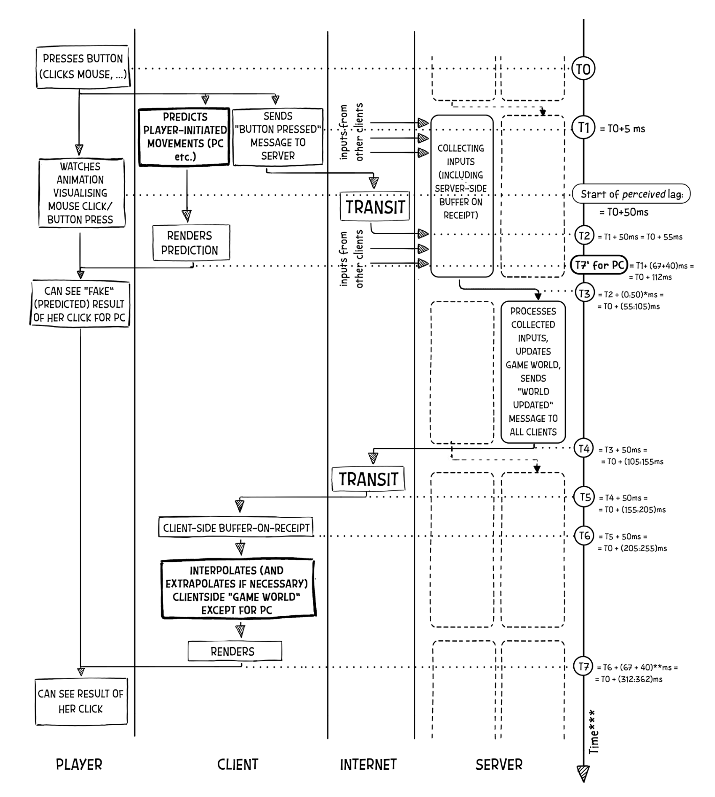
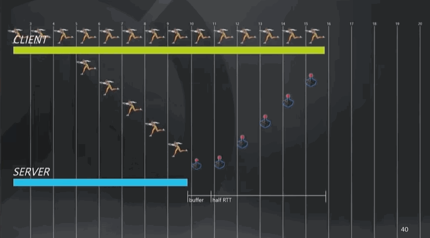

## Introduction

Shortly to say, `Obel` is game engine focusing on the complex game play developments.
It also comes with handy UI editor that helps game developments and bugfix.

Essentially, choke is just a game world simulator that advances game world states  
according to real/ai player inputs.

## Game Server Design

### Authoritative Server

As we know, there are physical limitations between the client and server:  
**network delay and jitter**.
Consequently, the game world states on the clients and server can have slight discrepancies.  
The longer the delay, the greater these differences become.

PC clients often make decisions based on their own view of the game.  
This can lead to disagreements between the clients and the server.  
For example, a PC client might see their fireball successfully hit an enemy,  
expecting the enemy to be defeated. However, when the server processes the event,  
it might find that the enemy was healed by a teammate before the fireball hit,  
so the server considers the enemy still alive.

In cases of disagreement between clients and the server,  
the authoritative server's state is always considered correct.

Additionally, due to network drop, delay, and jitter,  
client messages with the same tick number might arrive and  
be processed by the server at different tick.

### Philosophy

shortly to say, **_Everything in your game world should be modelled as Actor_**.
Below diagram display the relations between Actor world and ECS world  
in game designing.




As we can see, the processing of the authoritative data coming  
from the Server is still quite slow.  
But the main improvement in perceived responsiveness for  
those-actions-initiated-by-the player (and it is these actions  
that cause the “laggish” feeling, as timing of the actions by others is  
not that obvious for the player) comes from the Client-Side Prediction  
and the rendering of this pre-diction.

Client-Side Prediction is processed purely on the Client-Side,  
from receiving controller input, through Client-Side Prediction,  
and goes directly into rendering, without going to the Server at all,  
which (as you might have expected) helps latency a lot.

Of course, it is just a “prediction” (and in a sense is “fake”),  
but if it is 99% correct 99.99% of the time (and in the remaining  
cases the difference is not too great), it feels okay for the player,  
and this feeling is exactly what our players want us to achieve.

### Command Frame

you can see the below animation cited from **overwatch youtube** to illustrate
command frame and state propagation between clients and server.



The server and all its connected clients operate at a consistent  
fixed interval (frame) of 60fps, which equates to 16ms per frame.

At the conclusion of each frame, clients send the gathered and  
executed commands to the server.  
These commands are referred to as **_Command Frames (CF)_**.

Typically, CFs encompass CRUD operations performed by players,  
which impact the game world states. These actions can include spell casting,  
item consumption, or selling items.

Occasionally, a command (cd) involves more than just altering a variable value;  
it may require a complex workflow. For instance, the skill of the hero Axe in the  
game Dota 2 often involves intricate workflows and stateful logic that can extend  
beyond a single server tick.

In such case, we only transmit the **root command** to the server,  
allowing the server to execute the **sub-commands** independently.

### Client Interpolation

if our “network ticks” go at a rather typical 20 ticks/second,  
we can get our Client-Side rendering run at 60fps—simply creating  
two out of three rendered frames via such Client-Side Interpolation.

interpolation is easy to implement.
see [gabrielgambetta](https://www.gabrielgambetta.com/client-server-game-architecture.html)
for more details.

### Client Extrapolation

On the flip side, unlike interpolation, extrapolation causes significant complications.  
eg, while we’re extrapolating NPC movement, he runs into the wall. in such case,  
server reconciliation happens when the update comes from the Server,  
but our extrapolated position on the Client is different from the Server’s.

If we implement Server Reconciliation by simply correcting the coordinates whenever  
we receive an authoritative Server message, it can result in an unpleasant visual "jump"  
of the object from the "current" to the "new" position. To avoid this, a common approach  
is to initiate a new prediction based on the updated coordinates while continuing the  
"current" prediction based on the coordinates currently displayed.

During a **blending period**, a blended position is shown,  
gradually transitioning from the current prediction to the new one over time.  
For example:

```typescript
displayed_position(dt) =
current_predicted_position(dt) * (1 - alpha(dt)) + new_predicted_position(dt) * alpha(dt)
where alpha(t) = dt/BLENDING_PERIOD, and 0 <= dt < BLENDING_PERIOD
```

see Murphy's `DeadReckoning.pdf` and
[gabrielgambetta](https://www.gabrielgambetta.com/client-server-game-architecture.html)
for more details.

### Client Prediction

With Client-Side Interpolation and Client-Side Extrapolation for the replicated game entity,  
we can reduce stutter a bit (and also pump the rendering frame rate up to 60fps).  
However, even after these improvements, it is likely that the game will still feel  
“sluggish” for the PC.

To improve things further, it is common to use “Client-Side Prediction” for the PC.  
The idea here is to start moving the player’s own PC as soon as the player  
has pressed the button, completely eliminating this “sluggish” feeling for PC movements.

for Client-Side Prediction the discrepancy is usually more severe than  
for mere Client-Side Extrapolation. The reasons for this increased discrepancy  
for Client-Side Prediction are twofold:

▶ First, it happens due to a significantly larger time gap between the Client-Side  
Prediction and obtaining authoritative data from the Server-Side.

▶ Second, with Client-Side Prediction, other players are adding their inputs,  
which affect the Server but are usually not accounted for by Client-Side Prediction.

### Lag Compensation

TODO

### Messaging

All game object communicate with each other via exchanging messages with  
unique mailbox address.

Compare with the traditional invocation, messaging has the below advantages:

1. Decoupling of caller and callee in source code level to have easy unit  
   test and debugging with faster dev loop.
2. Easy thread modelling without worry about dead-lock and data racing issue.
3. Easy to integrate with Game editor and virtual scripting
4. Batch processing to have more predictable workloads. eg, we can separate  
   a bunch of bullet creations/deletions across multiple frames

### Server Game Tick

Client commands are sent using reliable-ordered UDP to ensure that each  
command for a specific server actor is executed in the exact sequence  
they were issued by the client.

This guarantees that commands affecting a particular server actor are  
processed in the correct order. However, commands from different clients  
targeting the same server actor are not ordered relative to each other,  
which poses a challenge in game server simulations, as discussed below:

The server's world simulation operates continuously to manage AI and other  
server-side logic, independent of any connected player clients. This is  
similar to natural phenomena like rain and snow occurring in the real world  
before human life existed.

Without network delays, client and server commands are processed  
synchronously within the same server tick. The server can execute  
commands in parallel using an actor framework without worrying about  
message drops.

However, network delays and buffering can cause client commands to be  
processed in later server ticks. This means server-side logic,  
such as AI decisions, is processed in the current tick, while delayed  
client commands are handled in subsequent ticks.

For example, if `pc1.cmd2.t2` should occur before `ai.heal.t4`, it ideally  
would be processed at t3 before `ai.heal.t4`. However, due to network jitter,  
it might be processed after `ai.heal.t4` at t5, leading to  
inconsistencies—such as an AI that should have died at t3 being healed by t4.

If this happens frequently, players may find the game too difficult or perceive  
abnormal game events that contradict what they have seen, leading to dissatisfaction.

To improve fairness, AI logic could be offloaded to another server,  
treating AI as game clients with a command buffer to introduce additional delays.  
This approach attempts to align the processing times of client  
and server commands as closely as possible.

But how do we align client commands?

By buffering client commands for one tick, if the network delay is  
stable within one tick period (e.g., 16ms), they are likely to be received  
and processed in one tick later at server. For example,  
`pc1.cmd1.t1` and `pc2.cmd1.t1` fired at t1 and both processed at t2.

This is the ideal scenario. However, due to jitter,
commands with the same tick can be processed in different server ticks.
For instance, `pc2.cmd1.t1` might arrive at tick 3 while `pc1.cmd1.t1`  
arrives at tick 2. As mentioned earlier, commands with the same tick number  
have no ordering constraints and can be processed in any order,  
so they are effectively equivalent.

but there is a situation where two client commands with different tick numbers  
arrive at the server ticks that violate their original order.
For example, `pc2.cmd2.t3` might arrive at tick 4 while `pc1.cmd2.t2` arrives
at tick 5 or at the same tick 4 due to `pc2` having a lower RTT than `pc1`.

In such cases, we need to process client commands respecting their
tick number - those in t2, then those in t3, and finally those in t4,
along with server-side commands at t4.

This approach works well, but when delayed commands with smaller tick numbers occur,
there is still a risk of incorrect ordering. We can either process these commands  
without regard to order or allow them to be processed later in the actor-level queue.  
Users can decide whether to replay the delayed command at the actor level,  
especially for write commands that directly alter actor states.

Note that to avoid inconsistent query results of different gos in each tick,
User must specify stage flag when send message. Most of messaging api already
been assigned the correct flag to make api user life easier.

In each tick, GT will finish concurrently processing all messages in that stage.
and buffer the incorrect message type for later processing in next stage.
If a message type has no matching stage, then it can be processed immediately
at any stage.

- mutation-stage (operations that mutates game world)
  - pre-physic-tick
    - handling-client-commands:
      action: deliver client commands to relevant actors
      messages: cudPhysicCollider,cudNavAgent,cudGO,setTimeout,setInterval
      transition-event:
      - SelfTransition
      - AllHandled->ticking-clock
    - ticking-clock:
      (prefer to timeout one-tick earlier to be more robust against jitter)
      derived: cudPhysicCollider,cudNavAgent,cudGO,setTimeout,setInterval
  - ticking-physic
    action: simulate physics
    transition-event: physic-ticked
    derived : collide-events
  - physic-ticked:
    action: deliver the buffered collide-events to the relevant actors
    derived carry to next tick: cudPhysicCollider,cudNavAgent,cudGO
- read-stage (operations that read game world)
  - query
    queryNavPath, queryActorState

### Why process messages in server ticks rather than relying on the automatic actor scheduler?

1. **Simplified Debugging**: Easier to implement `tick-by-tick` debugging.
2. **Simulation Control**: Simplifies the ability to pause, resume, accelerate, decelerate,
3. or replay the game world simulation.
4. **Message Batching**: Allows for optimization by processing messages in batches.
5. **Performance Optimization**: By processing messages in ticks, we can buffer more messages,
6. improving performance and reducing client frame (CF) delays for players with higher latency.
   The tick period offers some tolerance, allowing messages from players with smaller round-trip
   time (RTT) differences (under 16ms) to be processed within the same tick. To avoid a "replay storm"
   (where replaying one message can cause a flood of replays across actors), the system won’t rewind or
   replay simulations. Delayed messages are processed as if they arrived during the current game tick.

   **Note**: There is no perfect solution to network latency issues. Players with lower latency will  
   generally have an advantage.

### Introducing the GameTick (GT) Actor

The **GT actor** acts as a message interceptor,
advancing the game world at a fixed rate (e.g., 60 ticks per second).

Each **CommandFrame** from PC clients will carry a **TickNumber**,
used to maintain the correct order if 2 messages with same TickNumber
seen&processed at the same server tick due to the client network jitters
and server tick falling-behind.

All outgoing messages from actors are forwarded to the GT actor.
Actors use the **tell** pattern to send messages to the GT and avoid
using the **await** keyword in message handlers.
If there are data dependencies (such as needing an "await-then-await" scenario),
a state machine can simulate that flow.

For cases where there are no derived messages, a dummy `ResponseMsg` is sent to the GT.
Otherwise, the derived message is sent to acknowledge the original message.

When the tick arrives,
the GT performs batch optimizations, such as combining multiple messages.

The GT actor assigns an increasing **traceID** to TickMsg&CmdMsg.
This traceID is passed on to their derived messages,
ensuring that all messages are chained with same traceId.

The GT actor waits for all chains of messages to finish before advancing to the next tick,
effectively mimicking a traditional synchronous game loop within an asynchronous actor model.

If the game falls behind, the GT actor can fire queued messages
immediately and send extra `TickMsg` to physics and other actors to catch up.

`TickMsg` is only delivered after all other messages are processed, ensuring proper ordering.
This is particularly important for actors like **Physics** and **ReplicaManager**,
which must process all other messages before handling the `TickMsg`
to update the physics simulation and propagate game world changes.

After each tick, any newly derived messages are buffered for processing in the next tick.

### Parallelism and Message Ordering

Actors can run in parallel during each tick, but each actor processes its messages in a single-threaded manner,
ensuring message order is preserved. If an actor receives a message with a `parentMsgId`,
it removes the corresponding message from the sent buffer.

When the GT actor receives a `TickMsg`:

1. If there are still sent messages, it adds the `TickMsg` to the receive buffer.
2. It continues sending wake-up messages to itself until the sent buffer is empty.
3. It processes all messages in the receive buffer, then swaps the receive buffer with the sent buffer.
4. A timeout message is scheduled to handle the remaining time before the next tick.

This approach balances performance and message ordering,
making the system flexible for advanced features like debugging,
pause/resume controls, and network optimization while maintaining accurate game state simulation.

### Replay Storming

Replaying too many delayed messages can lead to a replay storm,
negatively affecting the game experience
for other players by causing excessive state rollbacks in their clients.
To avoid this, we need to impose limits:

When a delayed message arrives, we first check the difference between its
frameNumber and the current frameNumber.
If the difference exceeds a certain threshold (e.g., 3 frames),
the system will treat the message as failed and
notify the sending actor with the relevant error details.

If the difference is within the acceptable range,
the system will proceed to replay the message for that frame
and any subsequent messages from newer frames. While replaying
delayed messages, some previously sent messages
may need to be revoked recursively, affecting other actors.
This revocation can spread across many actors,
creating a replay storm that may require developers to intervene,
undoing message executions and their side
effects—a scenario that is often undesirable.

For example, if we replay a delayed message and discover
that Player A was already killed, but then
find out he cast a healing spell on Player B before he died,
saving player B life. Player B, now alive,
may go on to interact with Player C, who in turn affects others.
As you can see, replaying even a single
delayed message can trigger a chain reaction, or "butterfly effect,"
throughout the game world.
This can lead to a sudden surge in workload, potentially overwhelming
the system and making the game unplayable.

Fortunately, in most cases, especially when the server is not under heavy load,
message execution won't be delayed,
so the need for revocations should be rare.

If this situation occurs, a more practical solution is to avoid replaying the delayed message entirely and
instead treat it as if it's happening in the current tick.

However, if replaying is necessary—such as in critical cases like a "headshot"—we should only replay
the irreversible properties, such as a player's "alive" status, to minimize the impact.

Additionally, implementing a replay limit can help prevent replay storms and maintain
the stability of the game world.

### ECS & Statechart-based Actor Models

**_ECS_** is a modelling pattern specifically for the data and behavior of a game entity
from visible player and mobs to the invisible things like skill manager and mob spawner.

**_Actor_** allows developers to build reliable message-based systems by using actors to communicate.

**_Statechart_** can model the logic of actors. These actors can communicate with each other,
and with other actors, in the same way.
Actually each statechart is internally implemented by Actor.

The primary feature of statecharts is that states can be organized in a hierarchy
(so-called **_hierarchy FSM_**)
that shines to model and implement complex behavior-tree alike logics. eg skill manager.

When behavior is properly separated into a statechart, the remaining business logic is distilled into
small functions or actions, each of which can be understood in isolation, without the need to understand
when or why any particular function or action is invoked.

This type of code is often a lot easier to test too, since a function or action is not supposed to make
judgement on other functions or actions to invoke, but rather emit events that
should be handled by the statechart.

The statechart itself is a polar opposite; in that it does not “do” anything;
**_it is only designed to react to events and tell the surrounding code what to do._**
But it is just as easy to reason about, and also just as easy to verify.

A statechart is a state machine where each state in the state machine may define
its own subordinate state machines,
called substates. Those states can again define substates.

Here’s an example of a state in a state machine, with some extra features:


- The state is called “D”
- E and F are substates
- E even has a substate G
- entry and exit actions are mentioned

When the state machine enters this state D it also starts the state machine within it.
The initial state of this machine inside D is in fact E so it enters E too. And since E
has a single substate G, it is also entered.

A state with no substates is called an atomic state. eg D, E
A state with substates is called a compound state. eg G, F

#### Entering a state enters one of its substates

When a state is entered, its sub state machine starts and therefore, a substate is entered.
When a state is exited, its sub state machine is exited too, i.e. any substates also exit

In the example above, when the machine is told to enter D, it actually ends up entering D, E, and G.
Conversely, when the state machine exits D it also exits any substates.

Like state machines, statecharts also react to events; events are dealt with by the states and the main
side effects are specified by what happens upon entering and exiting states.

#### A state can have many “regions”

A compound state can be split up into completely separate (“orthogonal”) regions. Each region specifies
its own state machine. When a state machine enters such a state, it also enters all of the regions
of the state at the same time.


f this state is entered, then it enters both the top and bottom regions,
and the following statements will hold true so long as A is active:

Exactly one of B and C is active
Exactly one of D and E is active
Such a state is called a **_parallel state_**,
and the regions are often called **_orthogonal regions_**.

#### Transitions can be guarded

When an event happens, and the state machine would normally transition from one state to another,
statecharts introduce the concepts of guarding the transition. A guard is a condition placed upon the transition,
and the transition is essentially ignored if the guard condition is false.

#### States can have multiple transitions for the same event

The addition of guards allows a state to have more than one transition that reacts to the same event:
Two transitions fire on the same event, but only one is picked at run-time depending
on which one’s guards evaluate to TRUE.

#### Transitions can happen automatically

When entering a state, a transition can be defined which is automatically taken.
This is useful in conjunction with guards,
to move out of a state immediately upon entering it when certain conditions hold,
or as soon as those conditions hold.

#### Transitions can be delayed

Simply being in a state for a duration of time can be enough to transition to a different state.
This is accomplished by way of a delayed transition, which defines that the transition should be
taken a specific period of time after entering a state.

#### History

When exiting a compound state and its substate, it is sometimes useful to be able to return to exactly
the state that you left. Statecharts introduce the concepts of history states.
When a transition goes to a history state,
it re-enters the state that `was last active`.

### Game Swagger

The whole game is advanced by the statechart' receiving some msgs
(normal actor msgs and time-related msgs eg, timeout, stopwatch and delaying),
update some states, communicate, state transition, create or destroy some other statecharts.

In that sense, the ways it works make it quite
easy to develop and test game logics by feeding msg series to
some actors, advancing game progression or rolling back to any previous
CF and rolling forth to specific CF. Pretty much like video player.

To make sure the game at the correct states when we sending history msg,
we need to change the game engine runs at 'debug' mode so that it will return
'response' msg to the client after processing each CF.

That is pretty like how we do e2e tests in traditional 'web development' with
the use of swagger to send request and get response from http endpoint.

### Game Snapshot

Probably the most time-consuming task in game making is scenario-based testing
that requires the game world at specific states. So we need to provide the game programmer
the function similar to snapshot feature in vmware that records the frozen game world states
and then restore it for late dev or testing.

### Simple Expression

We can replicate this library to allow simple script to represent complex state-actions.
A useful feature would be to display the variable values in the short script text when
the user is debugging frame by frame.
<https://github.com/silentmatt/expr-eval?tab=readme-ov-file#expression-syntax>

### Game Development

to help developers, there is desktop-based game editor written by tarui/antd/3js,

which provides more advanced functions.

eg, 2d-top-down navigation path vitalization with current actor position.

actor runtime inspection & state diffs, fsm actor visualization, frame-by-frame
simulation and so on.

we will have another dedicated chapter to explain details of functions of editor.

For game devs, the above workflows can apply to unit tests and e2e tests.
no complex dependencies mockups for unit test! all the tests can be scripted
from game editor.

when the game starts first time, it instantiates first Actor from [xxx.actor](http://xxx.actor) file
stored in hard drive that is specified by game developer. During game life,
Actors are dynamically created and destroyed, reacting to different msgs received.

Each actor can be tagged with different kv pairs to make it easier for group operations
on them. eg, you can create and apply tag of "positive=true" to some skill actors that
have positive game effects to the player actors. then you can remove all positive skills
from player xxx as batch.

#### Game Editor

The game editor will be written by react app and communicates with the game render who communicates with game server
GameEditor <---IPC---> GameRender <---UDP---> GameServer

### Sprint Plan

1. Create poc of game tick logics using xstate.
   start date: 7-Oct-2024, estimated finish date: 7-Oct-2-24, 1 day
   - cover game tick actor, mocked player actor, mocked physics actor,
     mocked replicaManager, mocked multiple navManagers with parallels nav query

references：

- Godot Source Code Analysis
  <https://www.zhihu.com/column/c_1678155259791507456>
- 高品质游戏引擎开发
  <https://zhuanlan.zhihu.com/p/510064704>
- RTS Godot
  <https://www.youtube.com/watch?v=t-tkFxhpiCs&list=PLUzx1-8efVAoswyWSJh-du7HCCuVL3ckt&index=1>
- unreal5 movement component
  <https://zhuanlan.zhihu.com/p/664568047>

```

```
