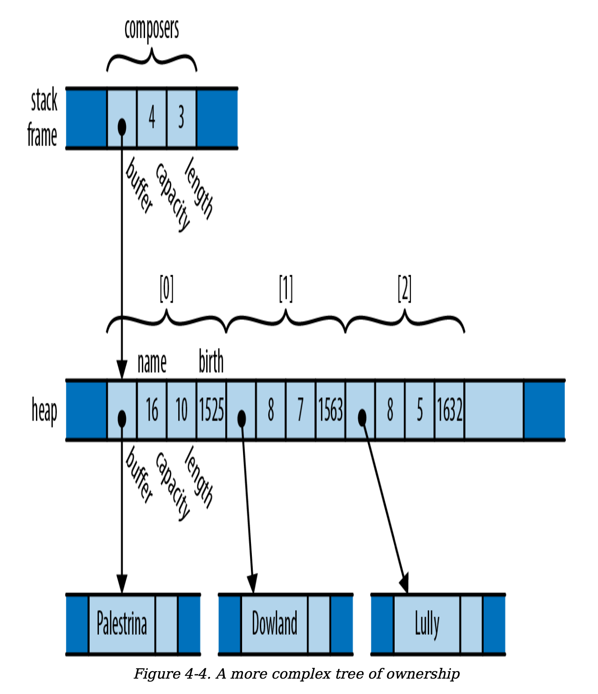
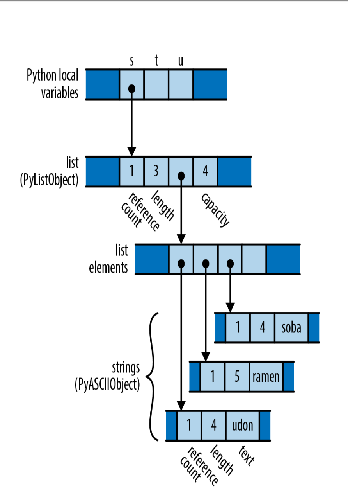
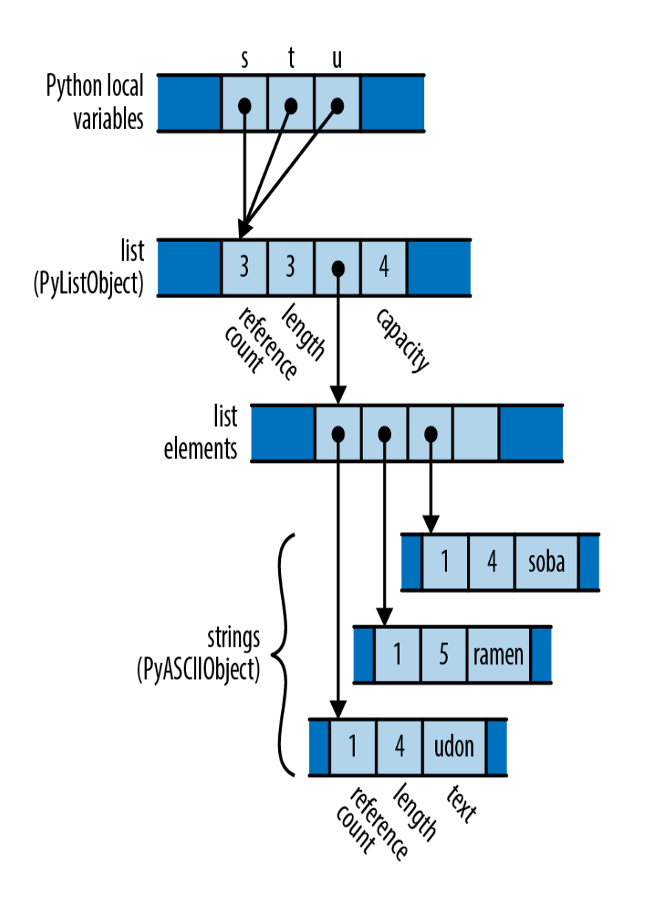
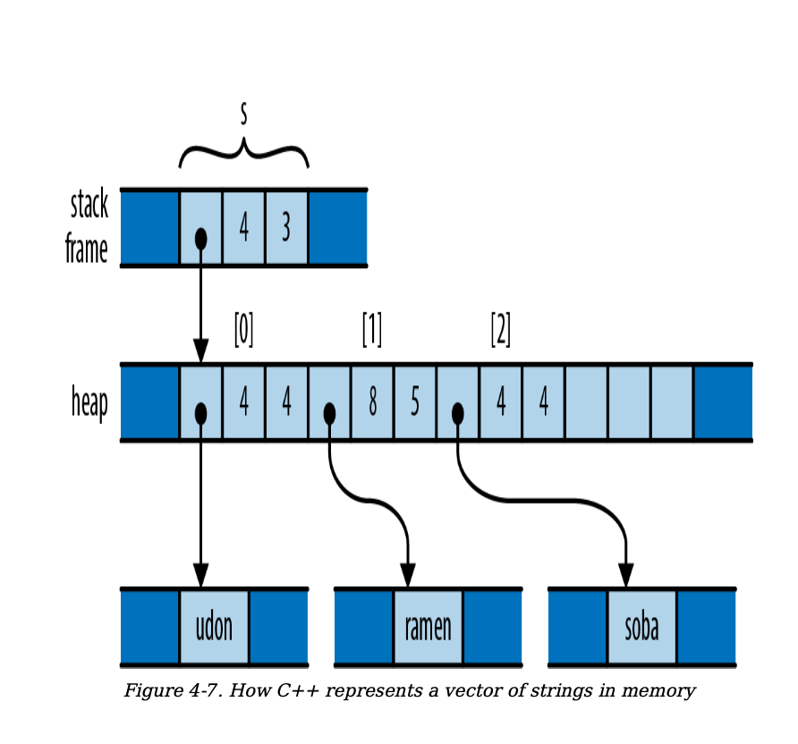
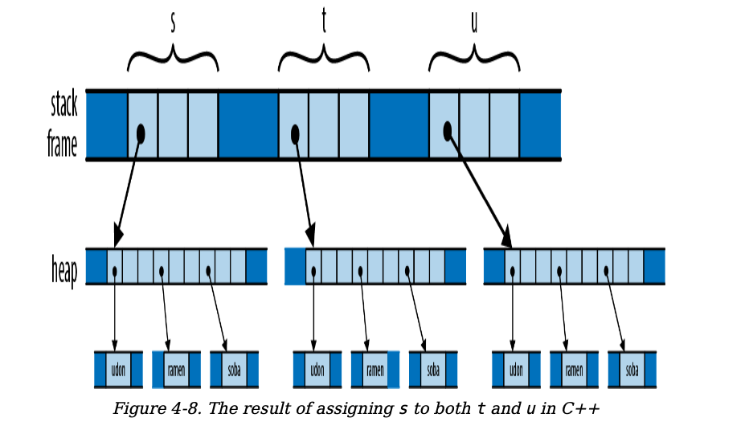
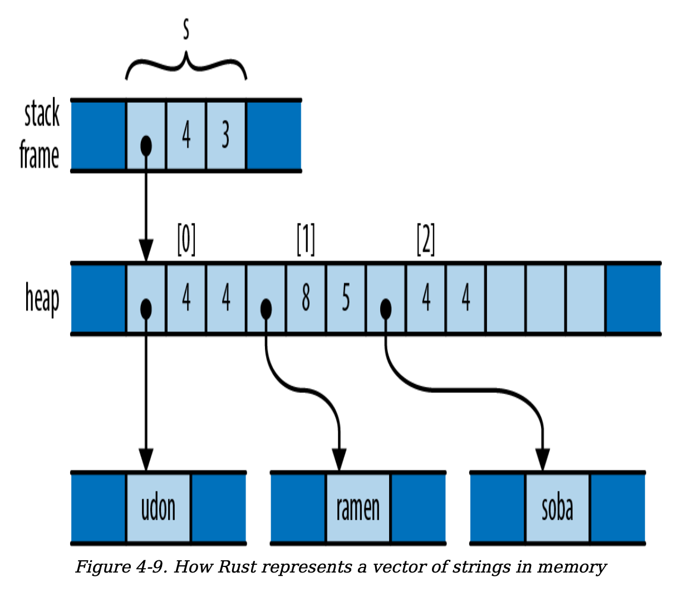
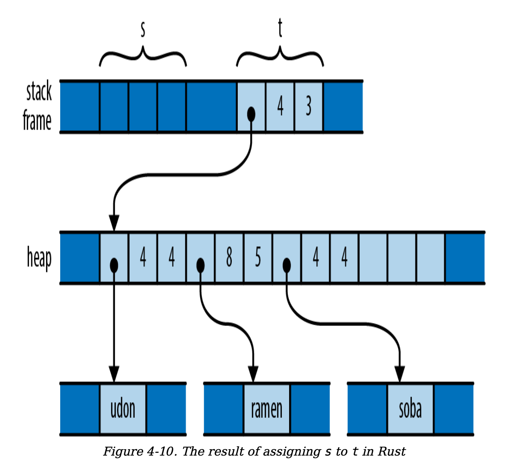

# `1. Ownership`
In Rust, a variable owns its value. When control leaves the block in which the variable is declared, the variable is dropped, and its value is dropped along with it. This is part of Rust's ownership model, which ensures memory safety without a garbage collector.

Below is an example that demonstrates how ownership and dropping work in Rust:

```rust
fn print_padovan() {
    // `padovan` is declared here and
    // owns the vector `vec![1, 1, 1]`.
    let mut padovan = vec![1, 1, 1]; // allocated here

    // A loop to calculate the next values
    // in the Padovan sequence.
    for i in 3..10 {
        let next = padovan[i - 3] + padovan[i - 2];
        padovan.push(next);
    }

    // Print the Padovan sequence from P(1) to P(10).
    println!("P(1..10) = {:?}", padovan);
} // `padovan` is dropped here, and its memory is freed.
```

## `1.1 Ownership Tree`
Every value has a single owner, making it easy to
decide when to drop it. But a single value may own many
other values.  the owners and their owned values form
trees: your owner is your parent, and the values you own
are your children. Every value in a Rust program is
a member of some tree, rooted in some variable. when that variable goes out of scope, the entire
tree goes with it. 

For example:



There are many ownership relationships here, but each one
is pretty straightforward:  

`composers` owns a `vector`; the vector owns its elements, each of which is a `Person` structure; each structure owns its `fields`; and the `string` field owns its `text`.  

Rust programs don’t usually explicitly drop values at all, in
the way C and C++ programs would use `free` and `delete`.  

The way to drop a value in Rust is to remove it from the
ownership tree somehow:  by leaving the scope of a
variable, or deleting an element from a vector, or
something of that sort.  

At that point, Rust ensures the value
is properly dropped, along with everything it owns.
eg, When control leaves the scope in which `composers` is declared, the program drops its value and takes the entire arrangement with it. 

## `1.2 Ownership Extension`
In a certain sense, Rust is less powerful than other
languages: every other practical programming language
lets you build `arbitrary graphs` of objects that point to each other in whatever way you see fit. But it is exactly because Rust is less powerful that the analyses the language can
carry out on your programs can be more powerful. Rust’s
safety guarantees are possible exactly because the
relationships it may encounter in your code are more
tractable. This is part of Rust’s “radical wager” we
mentioned earlier: in practice, Rust claims, there is usually
more than enough flexibility in how one goes about solving
a problem to ensure that at least a few perfectly fine
solutions fall within the restrictions the language imposes
从某种意义上说，Rust 的表达能力弱于其他编程语言：其他所有实用的编程语言都允许开发者构建`任意的对象图`，这些对象可以以任意方式相互引用。然而，正是由于 Rust 的表达能力较弱，它能够对程序进行更强大的静态分析。Rust 之所以能够提供内存安全和线程安全的保证，正是因为它所处理的代码中的关系更加可控和可预测。这是 Rust 的“激进赌注”的一部分：Rust 认为，在实际开发中，解决问题的途径通常具有足够的灵活性，足以确保至少有一些完全可行的解决方案能够满足语言所施加的限制条件。这种设计使得 Rust 能够在保证安全性的同时，仍然提供高效的编程体验。

That said, the concept of ownership as we’ve explained it
so far is still much too rigid to be useful. Rust extends this
simple idea in several ways:  

- You can `move` values from one owner to another.
This allows you to build, rearrange, and tear down
the tree. 

- Very simple types like integers, floating-point
numbers, and characters are excused from the
ownership rules. These are called `Copy` types.

- The standard library provides the `reference-counted
pointer` types Rc and Arc, which allow values to have
multiple owners, under some restrictions.  

- You can borrow a reference to a value; `references`
are non-owning pointers, with limited lifetimes.  

Each of these strategies contributes flexibility to the
ownership model, while still upholding Rust’s promises.
`We’ll explain each one in turn`.

### `1.2.1 Move`
#### `Python Move`
Consider the following Python code:
```python
s = ['udon', 'ramen', 'soba']
t = s
u = s
```
Each Python object carries a reference count, tracking the
number of values that are currently referring to it.
  

What happens when the program executes the assignments
to t and u? Python implements assignment simply by
making the destination point to the same object as the
source, and incrementing the object’s reference count:


#### `Cpp Move`
```c++
using namespace std;
vector<string> s = { "udon", "ramen", "soba" };
vector<string> t = s;
vector<string> u = s;
```


   


In a sense, C++ and Python have chosen opposite trade-
offs: Python makes assignment cheap, at the expense of
requiring reference counting (and in the general case,
garbage collection). C++ keeps the ownership of all the
memory clear, at the expense of making assignment carry
out a deep copy of the object.


#### `Rust Move`
In Rust, for most types, operations like assigning a value to
a variable, passing it to a function, or returning it from a
function don’t copy the value: they move it.

Rust applies move semantics to almost any use of a value.
- Initializing/assigning a value to a variable moves moves ownership to the variable. 
- Passing arguments to functions moves ownership to the function’s parameters;
- returning a value from a function moves ownership to the
caller. 
- and more...

Note that the moves always apply to the value proper, not the heap storage they own. For vectors and strings, the value proper is the three-word header alone; the potentially large element arrays
and text buffer sit where they are in the heap.

```rust
let s = vec!["udon".to_string(), "ramen".to_string(),
"soba".to_string()];
let t = s;
let u = s;
``` 



But recall that, in Rust, assignments of most types move
the value from the source to the destination, leaving the
source uninitialized:

     


What has happened here? The initialization let t = s;
moved the vector’s three header fields from s to t; `now t
owns the vector`. The vector’s elements stayed just where
they were, and nothing happened to the strings either.  

`Every value still has a single owner`, although one has
changed hands. There were no reference counts to be
adjusted. And the compiler now considers s uninitialized.  

So what happens when we reach the initialization let u =
s;? This would assign the uninitialized value s to u. Rust
prudently prohibits using uninitialized values, so the
compiler rejects this code with the following error:

```text
error[E0382]: use of moved value: `s`
|
7 | let s = vec!["udon".to_string(), "ramen".to_string(),
"soba".to_string()];
| - move occurs because `s` has type `Vec<String>`,
| which does not implement the `Copy` trait
8 | let t = s;
| - value moved here
9 | let u = s;
| ^ value used here after move
```

Consider the consequences of Rust’s use of a move here.
Like Python, the assignment is cheap: the program simply
moves the three-word header of the vector from one spot to
another. But like C++, ownership is always clear: the
program doesn’t need reference counting or garbage
collection to know when to free the vector elements and
string contents.

he price you pay is that you must explicitly ask for copies
when you want them:
```rust
let s = vec!["udon".to_string(), "ramen".to_string(),
"soba".to_string()];
let t = s.clone();
let u = s.clone();
```

We could also `re-create Python’s behavior` by using Rust’s
reference-counted pointer types; we’ll discuss those shortly
in `Rc and Arc: Shared Ownership`.   

#### `Moves with Control Flow`
```rust
let x = vec![10, 20, 30];
if c {
  f(x); // ... ok to move from x here
} else {
  g(x); // ... and ok to also move from x here
}
h(x); // bad: x is uninitialized here if either path uses it

let x = vec![10, 20, 30];
while f() {
  g(x); // bad: x would be moved in first iteration,
  // uninitialized in second
}

let mut x = vec![10, 20, 30];
while f() {
  g(x); // move from x
  x = h(); // give x a fresh value
}
e(x);
```

#### `Moves with Contest`
We’ve mentioned that a move leaves its source
uninitialized, as the destination takes ownership of the
value. But not every kind of value owner is prepared to
become uninitialized. For example, consider the following
code:

```rust
// Build a vector of the strings "101", "102", ... "105"
let mut v = Vec::new();
for i in 101 .. 106 {
v.push(i.to_string());
}
// Pull out random elements from the vector.
let third = v[2]; // error: Cannot move out of index of Vec
let fifth = v[4]; // here too
```

For this to work, Rust would somehow need to remember
that the third and fifth elements of the vector have become
uninitialized, and track that information until the vector is
dropped.  

In the most general case, vectors would need to
carry around extra information with them to indicate which
elements are live and which have become uninitialized.  

That is clearly not the right behavior for a systems
programming language; a vector should be nothing but a
vector. In fact, Rust rejects the preceding code with the
following error:

```text
error[E0507]: cannot move out of index of `Vec<String>`
|
14 | let third = v[2];
| ^^^^
| |
| move occurs because value has type `String`,
| which does not implement the `Copy` trait
| help: consider borrowing here: `&v[2]`
```

In the error message, Rust suggests using a reference, in
case you want to access the element without moving it.  

This is often what you want. But what if you really `do want
to move an element out of a vector`? You need to find a
method that does so in a way that respects the limitations
of the type. Here are three possibilities:

```rust
// Build a vector of the strings "101", "102", ... "105"
let mut v = Vec::new();
for i in 101 .. 106 {
v.push(i.to_string());
}

// 1. Pop a value off the end of the vector:
let fifth = v.pop().expect("vector empty!");
assert_eq!(fifth, "105");

// 2. Move a value out of a given index in the vector,
// and move the last element into its spot:
let second = v.swap_remove(1);
assert_eq!(second, "102");

// 3. Swap in another value for the one we're taking out:
let third = std::mem::replace(&mut v[2],
"substitute".to_string());
assert_eq!(third, "103");

// Let's see what's left of our vector.
assert_eq!(v, vec!["101", "104", "substitute"]);

//4. use optional
let first_name = std::mem::replace(&mut composers[0].name, None);
assert_eq!(first_name, Some("Palestrina".to_string()));
assert_eq!(composers[0].name, None);

// This call to take has the same effect as the earlier call to `std::mem::replace`.
let first_name = composers[0].name.take();
```

