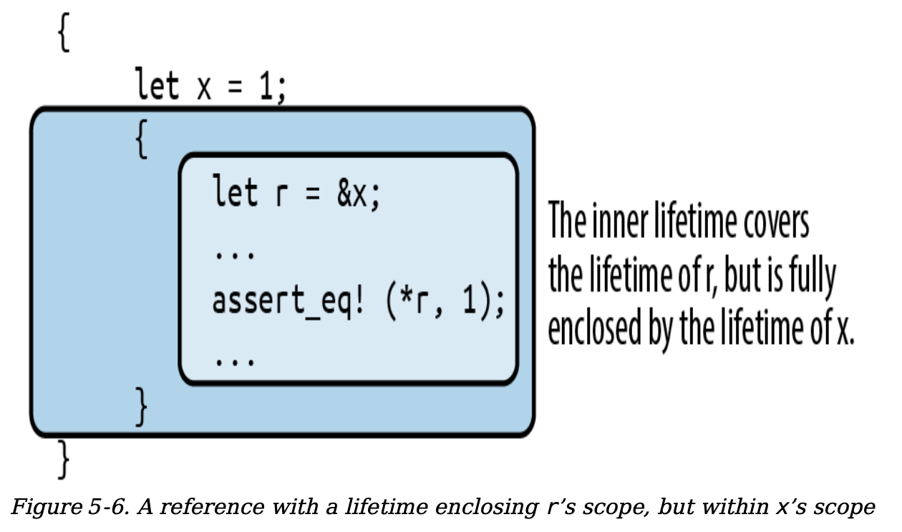

# `1. Ownership`
In Rust, a variable owns its value. When control leaves the block in which the variable is declared, the variable is dropped, and its value is dropped along with it. This is part of Rust's ownership model, which ensures memory safety without a garbage collector.

Below is an example that demonstrates how ownership and dropping work in Rust:

```rust
fn print_padovan() {
    // `padovan` is declared here and
    // owns the vector `vec![1, 1, 1]`.
    let mut padovan = vec![1, 1, 1]; // allocated here

    // A loop to calculate the next values
    // in the Padovan sequence.
    for i in 3..10 {
        let next = padovan[i - 3] + padovan[i - 2];
        padovan.push(next);
    }

    // Print the Padovan sequence from P(1) to P(10).
    println!("P(1..10) = {:?}", padovan);
} // `padovan` is dropped here, and its memory is freed.
```

## `1.1 Ownership Tree`
Every value has a single owner, making it easy to
decide when to drop it. But a single value may own many
other values.  the owners and their owned values form
trees: your owner is your parent, and the values you own
are your children. Every value in a Rust program is
a member of some tree, rooted in some variable. when that variable goes out of scope, the entire
tree goes with it. 

For example:


There are many ownership relationships here, but each one
is pretty straightforward:  

`composers` owns a `vector`; the vector owns its elements, each of which is a `Person` structure; each structure owns its `fields`; and the `string` field owns its `text`.  

Rust programs don’t usually explicitly drop values at all, in
the way C and C++ programs would use `free` and `delete`.  

The way to drop a value in Rust is to remove it from the
ownership tree somehow:  by leaving the scope of a
variable, or deleting an element from a vector, or
something of that sort.  

At that point, Rust ensures the value
is properly dropped, along with everything it owns.
eg, When control leaves the scope in which `composers` is declared, the program drops its value and takes the entire arrangement with it. 

# `2 Ownership Flexibility`
In a certain sense, Rust is less powerful than other
languages: every other practical programming language
lets you build `arbitrary graphs` of objects that point to each other in whatever way you see fit. But it is exactly because Rust is less powerful that the analyses the language can
carry out on your programs can be more powerful. Rust’s
safety guarantees are possible exactly because the
relationships it may encounter in your code are more
tractable. This is part of Rust’s “radical wager” we
mentioned earlier: in practice, Rust claims, there is usually
more than enough flexibility in how one goes about solving
a problem to ensure that at least a few perfectly fine
solutions fall within the restrictions the language imposes
从某种意义上说，Rust 的表达能力弱于其他编程语言：其他所有实用的编程语言都允许开发者构建`任意的对象图`，这些对象可以以任意方式相互引用。然而，正是由于 Rust 的表达能力较弱，它能够对程序进行更强大的静态分析。Rust 之所以能够提供内存安全和线程安全的保证，正是因为它所处理的代码中的关系更加可控和可预测。这是 Rust 的“激进赌注”的一部分：Rust 认为，在实际开发中，解决问题的途径通常具有足够的灵活性，足以确保至少有一些完全可行的解决方案能够满足语言所施加的限制条件。这种设计使得 Rust 能够在保证安全性的同时，仍然提供高效的编程体验。

That said, the concept of ownership as we’ve explained it
so far is still much too rigid to be useful. Rust extends this
simple idea in several ways:  

- You can `move` values from one owner to another.
This allows you to build, rearrange, and tear down
the tree. 

- Very simple types like integers, floating-point
numbers, and characters are excused from the
ownership rules. These are called `Copy` types.

- The standard library provides the `reference-counted
pointer` types Rc and Arc, which allow values to have
multiple owners, under some restrictions.  

- You can borrow a reference to a value; `references`
are non-owning pointers, with limited lifetimes.  

Each of these strategies contributes flexibility to the
ownership model, while still upholding Rust’s promises.
`We’ll explain each one in turn`.

## `2.1 Move`
### `2.1.1 Python`
Consider the following Python code:
```python
s = ['udon', 'ramen', 'soba']
t = s
u = s
```

Each Python object carries a reference count, tracking the
number of values that are currently referring to it.


What happens when the program executes the assignments
to t and u? Python implements assignment simply by
making the destination point to the same object as the
source, and incrementing the object’s reference count:


### `2.1.2 Cpp`
```c++
using namespace std;
vector<string> s = { "udon", "ramen", "soba" };
vector<string> t = s;
vector<string> u = s;
```


   


In a sense, C++ and Python have chosen opposite trade-
offs: Python makes assignment cheap, at the expense of
requiring reference counting (and in the general case,
garbage collection). C++ keeps the ownership of all the
memory clear, at the expense of making assignment carry
out a deep copy of the object.


### `2.1.3 Rust`
In Rust, for most types, operations like assigning a value to
a variable, passing it to a function, or returning it from a
function don’t copy the value: they move it.

Rust applies move semantics to almost any use of a value.
- Initializing/assigning a value to a variable moves moves ownership to the variable. 
- Passing arguments to functions moves ownership to the function’s parameters;
- returning a value from a function moves ownership to the
caller. 
- and more...

Note that the moves always apply to the value proper, not the heap storage they own. For vectors and strings, the value proper is the three-word header alone; the potentially large element arrays
and text buffer sit where they are in the heap.

```rust
let s = vec!["udon".to_string(), "ramen".to_string(),
"soba".to_string()];
let t = s;
let u = s;
``` 


But recall that, in Rust, assignments of most types move
the value from the source to the destination, leaving the
source uninitialized:

     


What has happened here? The initialization let t = s;
moved the vector’s three header fields from s to t; `now t
owns the vector`. The vector’s elements stayed just where
they were, and nothing happened to the strings either.  

`Every value still has a single owner`, although one has
changed hands. There were no reference counts to be
adjusted. And the compiler now considers s uninitialized.  

So what happens when we reach the initialization let u =
s;? This would assign the uninitialized value s to u. Rust
prudently prohibits using uninitialized values, so the
compiler rejects this code with the following error:

```text
error[E0382]: use of moved value: `s`
|
7 | let s = vec!["udon".to_string(), "ramen".to_string(),
"soba".to_string()];
| - move occurs because `s` has type `Vec<String>`,
| which does not implement the `Copy` trait
8 | let t = s;
| - value moved here
9 | let u = s;
| ^ value used here after move
```

Consider the consequences of Rust’s use of a move here.
Like Python, the assignment is cheap: the program simply
moves the three-word header of the vector from one spot to
another. But like C++, ownership is always clear: the
program doesn’t need reference counting or garbage
collection to know when to free the vector elements and
string contents.

he price you pay is that you must explicitly ask for copies
when you want them:
```rust
let s = vec!["udon".to_string(), "ramen".to_string(),
"soba".to_string()];
let t = s.clone();
let u = s.clone();
```

We could also `re-create Python’s behavior` by using Rust’s
reference-counted pointer types; we’ll discuss those shortly
in [Rc and Arc: Shared Ownership](###2.3)

### `2.1.1 Moves with Control Flow`
```rust
let x = vec![10, 20, 30];
if c {
  f(x); // ... ok to move from x here
} else {
  g(x); // ... and ok to also move from x here
}
h(x); // bad: x is uninitialized here if either path uses it

let x = vec![10, 20, 30];
while f() {
  g(x); // bad: x would be moved in first iteration,
  // uninitialized in second
}

let mut x = vec![10, 20, 30];
while f() {
  g(x); // move from x
  x = h(); // give x a fresh value
}
e(x);
```

### `2.1.2 Moves with Contest`
We’ve mentioned that a move leaves its source
uninitialized, as the destination takes ownership of the
value. But not every kind of value owner is prepared to
become uninitialized. For example, consider the following
code:

```rust
// Build a vector of the strings "101", "102", ... "105"
let mut v = Vec::new();
for i in 101 .. 106 {
v.push(i.to_string());
}
// Pull out random elements from the vector.
let third = v[2]; // error: Cannot move out of index of Vec
let fifth = v[4]; // here too
```

For this to work, Rust would somehow need to remember
that the third and fifth elements of the vector have become
uninitialized, and track that information until the vector is
dropped.  

In the most general case, vectors would need to
carry around extra information with them to indicate which
elements are live and which have become uninitialized.  

That is clearly not the right behavior for a systems
programming language; a vector should be nothing but a
vector. In fact, Rust rejects the preceding code with the
following error:

```text
error[E0507]: cannot move out of index of `Vec<String>`
|
14 | let third = v[2];
| ^^^^
| |
| move occurs because value has type `String`,
| which does not implement the `Copy` trait
| help: consider borrowing here: `&v[2]`
```

In the error message, Rust suggests using a reference, in
case you want to access the element without moving it.  

This is often what you want. But what if you really `do want
to move an element out of a vector`? You need to find a
method that does so in a way that respects the limitations
of the type. Here are three possibilities:

```rust
// Build a vector of the strings "101", "102", ... "105"
let mut v = Vec::new();
for i in 101 .. 106 {
v.push(i.to_string());
}

// 1. Pop a value off the end of the vector:
let fifth = v.pop().expect("vector empty!");
assert_eq!(fifth, "105");

// 2. Move a value out of a given index in the vector,
// and move the last element into its spot:
let second = v.swap_remove(1);
assert_eq!(second, "102");

// 3. Swap in another value for the one we're taking out:
let third = std::mem::replace(&mut v[2],
"substitute".to_string());
assert_eq!(third, "103");

// Let's see what's left of our vector.
assert_eq!(v, vec!["101", "104", "substitute"]);

//4. use optional
let first_name = std::mem::replace(&mut composers[0].name, None);
assert_eq!(first_name, Some("Palestrina".to_string()));
assert_eq!(composers[0].name, None);

// This call to take has the same effect as the earlier call to `std::mem::replace`.
let first_name = composers[0].name.take();
```

## `2.2 Copy`

The examples we’ve shown so far of values being moved
involve vectors, strings, and other types that could
potentially use a lot of memory and be expensive to copy.  
Moves keep ownership of such types clear and assignment
cheap. Also every move is a byte-for-byte, shallow copy that leaves the source uninitialized. Copies are the same, except that the source remains initialized.

But for simpler types like integers or characters,
this sort of careful handling really isn’t necessary.

Compare what happens in memory when we assign a
String with what happens when we assign an i32 value:

```rust
let string1 = "somnambulance".to_string();
let string2 = string1;
let num1: i32 = 36;
let num2 = num1;
```


`Only types for which a simple bit-for-bit copy suffices can
be Copy`:
 - all the machine integer
 - floating-point numeric
 - char
 - bool
 -  A tuple or fixed-size array of Copy types is
itself a Copy type.  

`Any type that needs to do something
special when a value is dropped cannot be Copy`: 
- a Vec/String/Box needs to free its elements
- a File needs to close its file handle
- a MutexGuard needs to unlock its mutex, and so on.
  
Bit-for-bit duplication of such types would leave it unclear
which value was now responsible for the original’s
resources.

What about types you define yourself? By default, `struct`
and `enum` types are `not` Copy:

If all the fields of your struct/enum are themselves Copy, then you can make the type Copy as well by placing the attribute #
[derive(Copy, Clone)] above the definition, like so:

```rust
#[derive(Clone, Copy)]
struct StringLabel { name: String }
```

## 2.3 Rc and Arc: Shared Ownership

Earlier we showed how Python uses reference counts to
manage its values’ lifetimes. You can use Rc to get a similar
effect in Rust. Consider the following code:

```rust
use std::rc::Rc;
// Rust can infer all these types; written out for clarity
let s: Rc<String> = Rc::new("shirataki".to_string());
let t: Rc<String> = s.clone();
let u: Rc<String> = s.clone();

// You can use any of String’s usual methods directly on an Rc<String>:
assert!(s.contains("shira"));
assert_eq!(t.find("taki"), Some(5));
println!("{} are quite chewy, almost bouncy, but lack flavor",
u);
```

For any type T, an Rc<T> value is a pointer to a heap-
allocated T that has had a reference count affixed to it.
Cloning an Rc<T> value does not copy the T; instead, it
simply creates another pointer to it and increments the
reference count.


### `2.3.1 Cyclic Reference`
One well-known problem with using reference counts to
manage memory is that, if there are ever two reference-
counted values that point to each other, each will hold the
other’s reference count above zero, so the values will never
be freed. Since Rc pointers hold their referents immutable,
it’s not normally possible to create a cycle.  

However, Rust does provide ways to create mutable portions
of otherwise immutable values; this is called interior mutability,
and we cover it in “Interior Mutability”. If you combine those
techniques with Rc pointers, you can create a cycle and leak memory.


```rust
use std::cell::RefCell;
use std::rc::Rc;
#[derive(Debug)]
struct Node {
    value: i32,
    next: Option<Rc<RefCell<Node>>>,
}
impl Node {
    fn new(value: i32) -> Rc<RefCell<Self>> {
        Rc::new(RefCell::new(Node {
            value,
            next: None,
        }))
    }
}
fn main() {
    // Create two nodes
    let node1 = Node::new(1);
    let node2 = Node::new(2);
    // Create a cyclic reference between node1 and node2
    node1.borrow_mut().next = Some(Rc::clone(&node2));
    node2.borrow_mut().next = Some(Rc::clone(&node1));
    // At this point, node1 and node2 reference each other, creating a cycle.
    println!("Node1: {:?}", node1);
    println!("Node2: {:?}", node2);
    // The cycle will prevent the reference counts from reaching zero,
    // causing a memory leak when the scope ends.
}
```

Note that `println()` thus reports stack overflow looping
between node 1 <-> node 2.

You can sometimes avoid creating cycles of Rc pointers by
using weak pointers, `std::rc::Weak`.

```rust
 use std::cell::RefCell;
    use std::rc::{Rc, Weak};
    #[derive(Debug)]
    struct Node {
        value: i32,
        // Use Weak instead of Rc to avoid cycles
        next: Option<Weak<RefCell<Node>>>,
    }
    impl Node {
        fn new(value: i32) -> Rc<RefCell<Self>> {
            Rc::new(RefCell::new(Node {
                value,
                next: None,
            }))
        }
    }
    // Create two nodes
    let node1 = Node::new(1);
    let node2 = Node::new(2);
    // Create a weak reference from node1 to node2
    node1.borrow_mut().next = Some(Rc::downgrade(&node2));
    // Create a weak reference from node2 to node1
    node2.borrow_mut().next = Some(Rc::downgrade(&node1));
    // Print the nodes
    println!("Node1: {:?}", node1);
    println!("Node2: {:?}", node2);
```

## `2.4 Reference`

Rust also has non-owning pointer types called references,
which have no effect on their referents’ lifetimes.   
`references must never outlive their referents`.  

Rust refers to creating a reference to some value
as `borrowing the value`: what you have borrowed,  
you must eventually return to its owner.

A reference lets you access a value without affecting its
ownership. References come in two kinds:
 - A `shared reference` lets you read but not modify its
referent. Shared references are Copy. you can have as many shared
references to a particular value at a time as you like.

- If you have a `mutable reference` to a value, you may
both read and modify the value. Mutable references are not Copy. you may not have any other references of any sort to that value active at the same time.

One can think of the distinction between shared and
mutable references as a way to `enforce a multiple readers
or single writer rule at compile time`.

- As long as there are `shared references(sref)` to a value,
not even its owner can modify it; the value is locked down.
Nobody can modify table while show is working with it.

- if there is a `mutable reference(mref)` to a value, it has exclusive access to the value; you can’t use the owner at all, until the mutable reference goes away.

the vec or string can re-allocate memory and so the srf can outlive the referent.

### `2.4.1 Assigning References`
Assigning a reference to a variable makes that variable
point somewhere new:

```rust
let x = 10;
let y = 20;
let mut r = &x;
if b { r = &y; }
assert!(*r == 10 || *r == 20);
```

### `2.4.2 Reference to Reference`

```rust
struct Point { x: i32, y: i32 }
let point = Point { x: 1000, y: 729 };
let r: &Point = &point;
let rr: &&Point = &r;
let rrr: &&&Point = &rr;
// actually traverses three references to get to the Point
// before fetching its y field
assert_eq!(rrr.y, 729);
```


### 2.4.3 Comparing References
```rust
let x = 10; let y = 10;
let rx = &x; let ry = &y;
let rrx = &rx; let rry = &ry;
assert!(rrx <= rry); assert!(rrx == rry);
```

== operator follows all the references and performs the
comparison on their final targets, x and y.

If you actually want to know whether
two references point to the same memory, you can use
std::ptr::eq, which compares them as addresses:
```rust
// their referents are equal
assert!(rx == ry); 
// but occupy different addresses
assert!(!std::ptr::eq(rx, ry)); 
```

Note that the operands of a comparison must have exactly
the same type, including the references:

```rust
// error: type mismatch: `&i32` vs `&&i32`
assert!(rx == rrx); 
// this is okay
assert!(rx == *rrx); 
```

### 2.4.4 References Are Never Null
In Rust, if you need a value that is either a
reference to something or not, use the type `Option<&T>`.  

At the machine level, Rust represents `None` as a null pointer
and `Some(r)`, where r is a &T value, as the nonzero address,
so Option<&T> is just as efficient as a nullable pointer in C
or C++, even though it’s `safer`: its type requires you to
check whether it’s None before you can use it.

### 2.4.5 Borrowing References to Arbitrary Expressions

```rust
fn factorial(n: usize) -> usize { (1..n+1).product() }
let r = &factorial(6);
// Arithmetic operators can see
// through one level of references.
assert_eq!(r + &1009, 1729);
```

In situations like this, Rust simply creates an anonymous
variable to hold the expression’s value and makes the
reference point to that. The lifetime of this anonymous
variable depends on what you do with the reference:

- If you immediately assign the reference to a variable
in a let statement (or make it part of some struct or
array that is being immediately assigned), then Rust
makes the anonymous variable live as long as the
variable the let initializes.  eg, ```rust let r = &factorial(6);```

- Otherwise, the anonymous variable lives to the end
of the enclosing statement. eg, ```rust assert_eq!(r + &1009, 1729);```

### 2.4.5 References to Slices and Trait Objects
The references we’ve shown so far are all simple
addresses. However, Rust also has `fat pointers`:
- `ref slice`, carrying the starting address of the slice and its length.
- `trait object`, A trait object carries a value’s address and a pointer to the trait’s implementation appropriate to that value, for invoking the trait’s methods

## 2.5 Reference Safety
A `lifetime` is code stretch/scope where a reference could be safe to use: a statement, an expression, the scope of some variable, or the like.

two different references variables with same lifetime annotation eg, `'a`must have an `intersection` (overlapping scope), but they are not necessarily identical.

At run time, a reference is nothing but an address; its lifetime is part of its type and has no run-time representation.

A reference is `safe to use` if the rust complier can find out a smallest lifetime that is >= the lifetime of reference variable and <= the lifetime of referent variable.


### 2.5.1 Reference in Local Variable

#### 2.5.1.1 No valid lifetime found:
  

```text
error: `x` does not live long enough
--> references_dangling.rs:8:5
|
7 | r = &x;
| ^^ borrowed value does not live long enough
8 | }
| - `x` dropped here while still borrowed
9 | assert_eq!(*r, 1); // bad: reads memory `x` used to
occupy
10 | }
```   


#### 2.5.1.2 Valid lifetime found:


### 2.5.2 Reference in Function Arguments
```rust
static mut STASH: &i32 = &10;
fn f(p: &'static i32) {
  unsafe { STASH = p; }
}

static WORTH_POINTING_AT: i32 = 1000;
f(&WORTH_POINTING_AT);
```
the lifetime `'a` =
the `smallest` value in [`'p`, `'WORTH_POINTING_AT`] = `'g()` => `valid`  lifetime where:
 - `'p` represents the lifetime of reference param p at line 645.
 - `'WORTH_POINTING_AT` represents the lifetime of static variable WORTH_POINTING_AT that is `static` at whole program.
 - `'g()` represents the smallest valid lifetime enclosing 'p and enclosed by 'WORTH_POINTING_AT at line 644 -> 646 which is the scope of g() function.

### 2.5.3 Passing References to Functions
```rust
fn g<'a>(p: &'a i32) { ... }
let x = 10;
g(&x);
```
`'a` = smallest(['p, 'x]) = 'g() => `valid`


### 2.5.4 Returning References
```rust
// v should have at least one element.
fn smallest(v: &a'[i32]) -> &a'i32 {
  let mut s = &v[0];
  for r in &v[1..] {
    if *r < *s { s = r; }
  }
  return s;
}
```

`Invalid lifetime case:`
```rust
let s;
{
let parabola = [9, 4, 1, 0, 1, 4, 9];
s = smallest(&parabola);
}
assert_eq!(*s, 0); // bad: points to element of dropped array

error: `parabola` does not live long enough
--> references_lifetimes_propagated.rs:12:5
|
11 | s = smallest(&parabola);
| -------- borrow occurs here
12 | }
| ^ `parabola` dropped here while still borrowed
13 | assert_eq!(*s, 0); // bad: points to element of dropped
array
| - borrowed value needs to live until here
14 | }
}
assert_eq!(*s, 0); // bad: points to element of dropped array
```
`v'a` = smallest(['v, 'parabola]) = 'smallest() => `valid`
`s'a` = smallest(['s, 'parabola]) where 's > 'parabola => `invalid`

`Valid lifetime case:`
```rust
{
  let parabola = [9, 4, 1, 0, 1, 4, 9];
  let s = smallest(&parabola);
  assert_eq!(*s, 0); // fine: parabola still alive
}
```
`v'a` = smallest(['v, 'parabola]) = 'smallest() => `valid`
`s'a` = smallest(['s, 'parabola]) = 's => `valid`


### 2.5.5 Structs Containing References

```rust
struct S<'a> {
  r: &'a i32
}
let s;
{
  let x = 10;
  s = S { r: &x };
}
assert_eq!(*s.r, 10);
```
As S and S.r have same lifetime 'a, => `s.r'a` = `s'a`.
As s.r is filed of S, so `'(s.r)='s`,
So we have: `s.r'a` = `s'a` = smallest(['(s.r)='s, 'x]) where 's > 'x => `invalid`

```rust
struct D {
  s: S<'static>
}
let d;
{
  let x = 10;
  d = D { s: S { r: &x } };
}
assert_eq!(*d,s.r, 10);
```
`s'a` = `s.r'a` = smallest(['(s.r)='s='d, 'x]) where 'd > 'x => `invalid` != s'static.

```rust
struct D {
  s: S<'static>
}
let d;
{
  static let x = 10;
  d = D { s: S { r: &x } };
}
assert_eq!(*d,s.r, 10);
```
Valid lifetime range `s'a` = s.r'a = ['(s.r)='s='d, 'x] = ['d, 'x] = `['d, 'static]`; Obviously, the actual lifetime `s'static` is in the range of `['d, 'static]`, so `valid`

### 2.5.6 Distinct Lifetime Parameters

`Invalid lifetime case: `
```rust
struct S<'a> {
  x: &'a i32,
  y: &'a i32
}
// Both references use the same lifetime 'a.
// error if your want to do something like this:
let x = 10;
let r;
{
  let y = 20;
  {
    let s = S { x: &x, y: &y };
    r = s.x; // assign to another ref variable r
  }
}
println!("{}", r);
```
s'a = `s.x'a` = r'a = ['(s.x)='s='r, 'x] = ['r, 'x] = 'r;
s'a = `s.y'a` = y'a = ['(s.y)='s, 'x] = ['s, 'x] = 's;
however, 'r != 's, => `invalid`

`Valid lifetime case: `
```rust
struct S<'a,'b> {
  x: &'a i32,
  y: &'b i32
}
```
'a = s'a = `s.x'a` = r'a = ['(s.x)='s='r, 'x] = ['r, 'x] = 'r;
'b = s'b = `s.y'b` = y'b = ['(s.y)='s, 'x] = ['s, 'x] = 's;
As 'a != 'b => `invalid`

### `2.5.6 Lifetime Bound with PhantomData`

```rust
pub struct Iter<'a, T: 'a> {
    head: Option<NonNull<Node<T>>>,
    tail: Option<NonNull<Node<T>>>,
    len: usize,
    marker: PhantomData<&'a Node<T>>,
}
```

'a = Iter'a = T'a =T(any ref)'a = &Node<T>'a = marker'a =   
min['Iter, 'T(any referent)] where 'Iter <= 'T(any referent)

1 `Why is T: 'a Needed?`
 - In Rust, a type T might contain `references` with their own lifetimes.
 - T: 'a ensures that if T contains any references, those references must be 'a.

2 `Why is PhantomData<&'a Node<T>> Needed?`
Rust’s compiler only considers fields that are actually used
when determining lifetimes and ownership. However, in this struct:

 - head and tail are of type Option<NonNull<Node<T>>>, which are `raw pointers`.
 - Raw pointers do not affect Rust’s `borrow checker` (since they don’t enforce ownership rules).
 - Without an explicit `lifetime marker`, Rust wouldn’t know that this struct is tied to 'a.
   PhantomData<&'a Node<T>> explicitly tells the Rust compiler that this struct holds references tied to 'a.

Together, these ensure that Iter can safely access `Node<T>` and any values pointed by the references in the `T`.

## 2.6 Share & Mutation

So far, we’ve discussed how Rust ensures no reference will
ever point to a variable that has gone out of scope. But
there are other ways to `introduce dangling pointers`.

### 2.6.1 Dandling pointer by reassignment:
```rust
let v = vec![4, 8, 19, 27, 34, 10];
let r = &v;
let aside = v; // move vector to aside
r[0]; // bad: uses `v`, which is now uninitialized

error[E0505]: cannot move out of `v` because it is borrowed
--> references_sharing_vs_mutation_1.rs:10:9
|
9 | let r = &v;
| - borrow of `v` occurs here
10 | let aside = v; // move vector to aside
| ^^^^^ move out of `v` occurs here
```
r'a = smallest(['r, 'v]) and `let aside = v;` => 'r > 'v => `invalid`


### Valid lifetime case:
```rust
let v = vec![4, 8, 19, 27, 34, 10];
{
  let r = &v;
  r[0]; // ok: vector is still there`
}
let aside = v;
```
r'a = smallest(['r, 'v]) => `r` => `valid`

### 2.6.2 Dandling pointer by memory reallocation:

```rust
fn extend(vec: &mut Vec<f64>, slice: &[f64]) {
  for elt in slice {
    vec.push(*elt);
  }
}
let mut wave = ec![0.0, 1.0, 0.0,];
extend(&mut wave, &wave);
assert_eq!(wave, vec![0.0, 1.0, 0.0, 0.0, 1.0, 0.0,]);

error[E0502]: cannot borrow `wave` as immutable because it is
also
borrowed as mutable
--> references_sharing_vs_mutation_2.rs:9:24
|
9 | extend(&mut wave, &wave);
| ---- ^^^^- mutable borrow ends here
| | |
| | immutable borrow occurs here
| mutable borrow occurs here

```


### 2.6.3 Reference Lifetime Impacts Other Values in Ownership Tree
Each kind of reference affects what we can do with the
values along the owning path to the referent, and the
values reachable from the referent:

- `Shared access is read-only access.`
Values borrowed by shared references are read-only.
Across the `lifetime` of a shared reference, neither its
referent, nor anything reachable from that referent, can
be changed by anything. There exist no live mutable
references to anything in that structure, its owner is
held read-only, and so on. It’s really frozen.

- `Mutable access is exclusive access.`
A value borrowed by a mutable reference is reachable
exclusively via that reference. Across the `lifetime` of a
mutable reference, there is no other usable path to its
referent or to any value reachable from there. The only
references whose lifetimes may overlap with a mutable
reference are those you borrow from the mutable
reference itself.

 

So there’s no way for the program to do anything that will invalidate the reference. Rust applies these rules everywhere: if we borrow,
say, a shared reference to a key in a HashMap, we can’t
borrow a mutable reference to the HashMap until the shared
reference’s lifetime ends.

`More example:`
 
 

```cpp
struct File {
  int descriptor;
  File(int d) : descriptor(d) { }
  File& operator=(const File &rhs) {
    close(descriptor);
    descriptor = dup(rhs.descriptor);
    return *this;
  }
};
```
The assignment operator is simple enough, but fails badly
in a situation like this:
```cpp
File f(open("foo.txt", ...));
f = f;

If we assign a File to itself, both rhs and *this are
the same object, so operator= closes the very file
descriptor it’s about to pass to dup. We destroy the
same resource we were meant to copy.
```

In Rust, the analogous code would be:
(This is `not idiomatic Rust`.)
```rust
struct File {
  descriptor: i32
}
fn new_file(d: i32) -> File {
  File { descriptor: d }
}
fn clone_from(this: &mut File, rhs: &File) {
  close(this.descriptor);
  this.descriptor = dup(rhs.descriptor);
}

let mut f = new_file(open("foo.txt", ...));
...
clone_from(&mut f, &f);

error[E0502]: cannot borrow `f` as immutable because it is also
borrowed as mutable
--> references_self_assignment.rs:18:25
|
18 | clone_from(&mut f, &f);
| - ^- mutable borrow ends here
| | |
| | immutable borrow occurs here
| mutable borrow occurs here
```

## 2.7 A sea od Objects
Since the rise of automatic memory management in the
1990s, the default architecture of all programs has been the `sea of objects`,


However, Rust prefers for pointers, ownership, and data flow to pass through the system in one direction, akka `tree of objects`.

It takes a bit of effort to make a cycle in Rust—two values such that each one contains a reference pointing to the other. You have to use a smart pointer type, such as `Rc`, and `interior mutability`.


