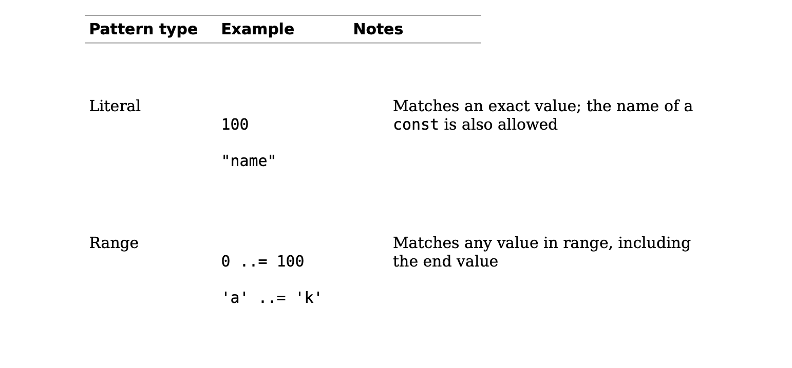
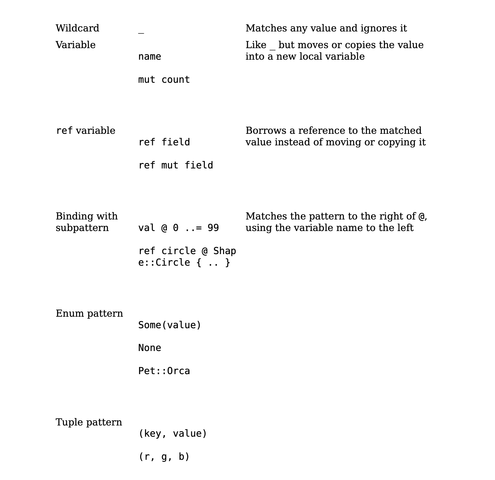
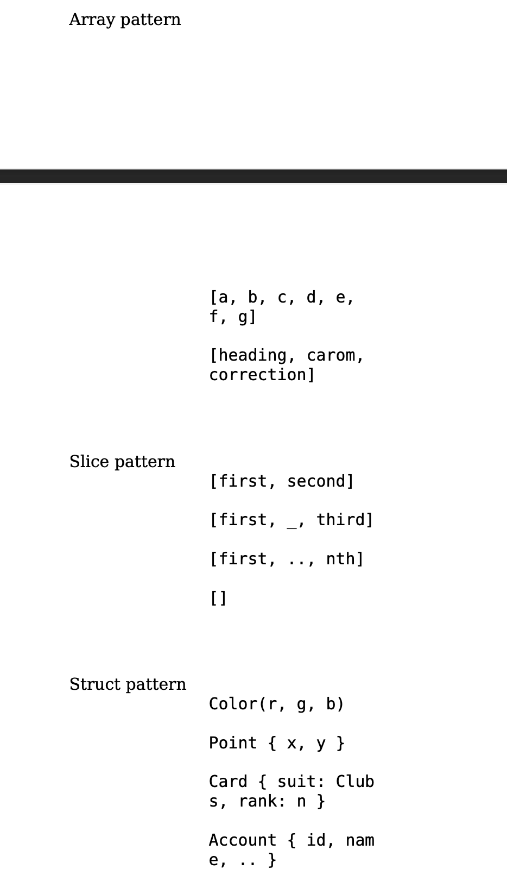
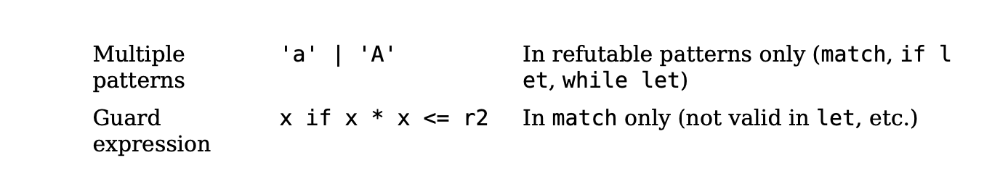

# Pattern Match \





## Where Pattern Apply
Although patterns are most prominent in match
expressions, they are also allowed in several other places,
typically in place of an identifier. The meaning is always the
same: instead of just storing a value in a single variable,
Rust uses pattern matching to take the value apart.

```rust
// ...unpack a struct into three new local variables
let Track { album, track_number, title, .. } = song;
// ...unpack a function argument that's a tuple
fn distance_to((x, y): (f64, f64)) -> f64 { ... }
// ...iterate over keys and values of a HashMap
for (id, document) in &cache_map {
println!("Document #{}: {}", id, document.title);
}
// ...automatically dereference an argument to a closure
// (handy because sometimes other code passes you a reference
// when you'd rather have a copy)
let sum = numbers.fold(0, |a, &num| a + num);
```

the 4 examples above are `irrefutable patterns`,
and they’re the only patterns allowed in the four places shown here  
(after let, in function arguments, after for, and in closure arguments).
And they are always matching.

A `refutable pattern` is one that might not match, like Ok(x),
which doesn’t match an error result, or '0' ..= '9',
which doesn’t match the character 'Q'. Refutable patterns
can be used in match arms, because match is designed for
them: if one pattern fails to match, it’s clear what happens
next

`Refutable patterns` are also allowed in if let and while
let expressions, which can be used to...

```rust
// ...handle just one enum variant specially
if let RoughTime::InTheFuture(,__) = user.date_of_birth() {
  user.set_time_traveler(true);
}
// ...run some code only if a table lookup succeeds
if let Some(document) = cache_map.get(&id) {
  return send_cached_response(document);
}
// ...repeatedly try something until it succeeds
while let Err(err) = present_cheesy_anti_robot_task() {
  log_robot_attempt(err);
  // let the user try again (it might still be a human)
}
// ...manually loop over an iterator
while let Some(_) = lines.peek() {
  read_paragraph(&mut lines);
}
```
