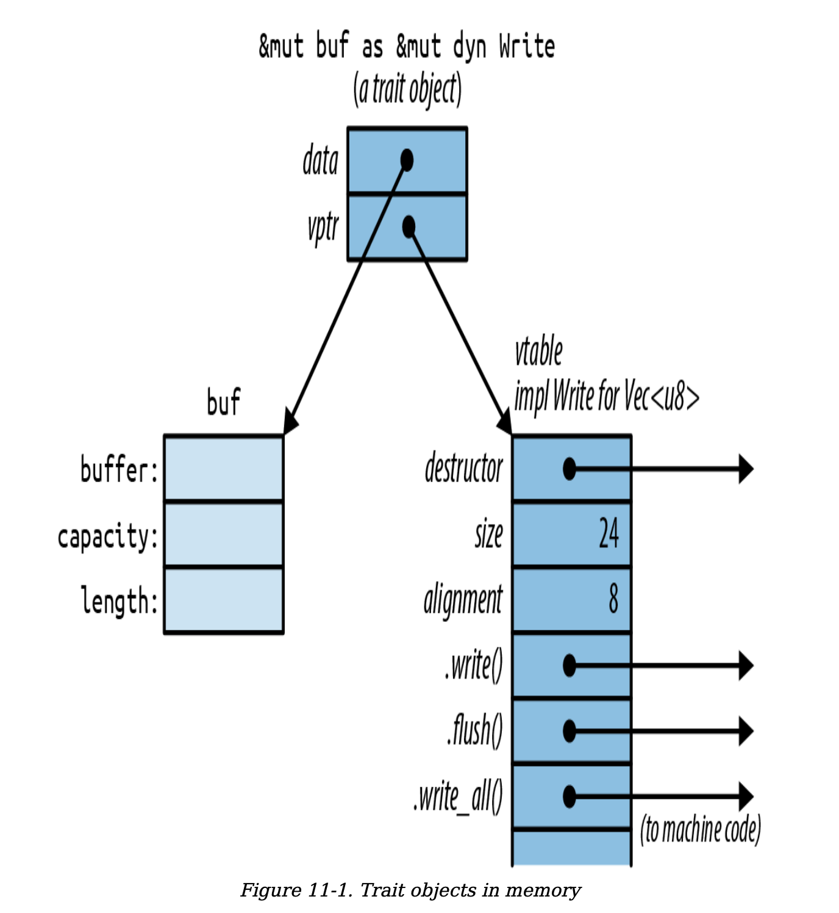

```
[A] computer scientist tends to be able to deal with
nonuniform structures—case 1, case 2, case 3—while a
mathematician will tend to want one unifying axiom that
governs an entire system.
```
—`Donald Knuth`

# `1 Trait Object`

Rust does not support downcasing from the trait object &mut dyn Write back to a concrete type like Vec<u8>.

```rust
let mut buf: Vec<u8> = vec![];
let writer: &mut dyn Write = &mut buf; // ok
let w: Box<dyn Write> = Box::new(local_file);

// This kind of reference conversion is the only way to create a trait
// object. What the compiler is actually doing here is very
// simple. At the point where the conversion happens, Rust
// knows the referent’s true type (in this case, File),
// so it just adds the address of the appropriate vtable
// turning the regular pointer into a fat pointer.
```

 

# `2 Generic`
```rust
fn say_hello<W: Write>(out: &mut W) -> std::io::Result<()> {
  out.write_all(b"hello world\n")?;
  out.flush()
}

say_hello(&mut local_file)?; // calls say_hello::<File>
say_hello(&mut bytes)?; // calls say_hello::<Vec<u8>>
```

## Generic functions can have multiple type parameters:
```rust
fn run_query<M, R>(data: &DataSet, map: M, reduce: R) -> Results
where M: Mapper + Serialize,
      R: Reducer + Serialize
{ ... }
```

The `type parameters` M and R are still declared up front, but
the `bounds` are moved to separate lines. This kind of where
clause is also allowed on generic structs, enums, type
aliases, and methods—`anywhere` bounds are permitted.

A generic function can have both lifetime parameters and type parameters. Lifetime parameters come first:
```rust
/// Return a reference to the point in `candidates`
/// that's closest to the `target` point.
fn nearest<'t, 'c, P>(target: &'t P, candidates: &'c [P]) -> &'c P
where P: MeasureDistance
{
  ...
}
```

`Lifetimes` never have any impact on machine code. Two
calls to nearest() using the same type P, but different
lifetimes, will call the `same` compiled function. Only
`differing` types cause Rust to compile multiple copies of a
generic function.

Of course, functions are not the only kind of generic code in Rust:
- Generic Structs
- Generic Enums
- Generic Traits
- An individual method can be generic, even if the type it’s defined on is not generic:
```rust
impl PancakeStack {
  fn push<T: Topping>(&mut self, goop: T) -> PancakeResult<()> 
  {
    goop.pour(&self);
    self.absorb_topping(goop)
  }
}
```
- Type aliases can be generic, too:
```rust
type PancakeResult<T> = Result<T, PancakeError>;
```

All the features introduced in this section—`bounds`, `where`
clauses, `lifetime` parameters, and so forth—can be used on
all generic items, not just functions.

## Which to Use

`Trait objects` are the right choice whenever you need a
collection of values of mixed types, all together:

```rust
struct Salad {
  veggies: Vec<Box<dyn Vegetable>>
}
```

`Generics` have important advantages
over trait objects, with the result that in Rust, generics are
the more `common` choice.
- `Speed`: Rust has all the information it needs to optimize
away this function call entirely.
- `Not every trait can support trait objects.`
Traits support several features,
such as associated functions, that work only with generics:
they rule out trait objects entirely.
- It’s easy to bound a generic type parameter with `several traits` at once     

# `Defining Traits`

```rust
/// A trait for characters, items, and scenery -
/// anything in the game world that's visible on screen.
trait Visible {
  /// Render this object on the given canvas.
  fn draw(&self, canvas: &mut Canvas);
  /// Return true if clicking at (x, y) should
  /// select this object.
  fn hit_test(&self, x: i32, y: i32) -> bool;
}

impl Visible for Broom {
  fn draw(&self, canvas: &mut Canvas) {
    for y in self.y - self.height - 1 .. self.y {
      canvas.write_at(self.x, y, '|');
    }
    canvas.write_at(self.x, self.y, 'M');
  }
  fn hit_test(&self, x: i32, y: i32) -> bool {
    self.x == x
    && self.y - self.height - 1 <= y
    && y <= self.y
  }
}
```

# `Default Trait Methods`

```rust
trait Write {
  fn write(&mut self, buf: &[u8]) -> Result<usize>;
  fn flush(&mut self) -> Result<()>;
  fn write_all(&mut self, buf: &[u8]) -> Result<()> {
    let mut bytes_written = 0;
    while bytes_written < buf.len() {
      bytes_written += self.write(&buf[bytes_written..])?;
    }
    Ok(())
  }
  ...
}
```

The most dramatic use of default methods in the standard
library is the Iterator trait, which has one required
method (`.next()`) and dozens of `default` methods.

# `Extension Trait`
You can even use a generic impl block to add an extension
trait to a whole family of types at once. This trait could be
implemented on any type:
```rust
use std::io::{self, Write};
/// Trait for values to which you can send HTML.
trait WriteHtml {
  fn write_html(&mut self, html: &HtmlDocument) -> io::Result<()>;
}
```
Implementing the trait for all writers makes it an extension
trait, adding a method to all Rust writers:
```rust
/// You can write HTML to any std::io writer.
impl<W: Write> WriteHtml for W {
  fn write_html(&mut self, html: &HtmlDocument) -> io::Result<()> {
    ...
  }
}
```

The line impl<W: Write> WriteHtml for W means `for
every type W that implements Write, here’s an
implementation of WriteHtml for W`.

when you implement a trait, either the
`trait` or the `type` must be `new` in the current crate. This is
called the `orphan rule`. It helps Rust ensure that trait
implementations are unique. Your code can’t impl Write
for u8, because both Write and u8 are defined in the
standard library.

# `Self in Traits`
 if we define this trait:
 ```rust
pub trait Spliceable {
  fn splice(&self, other: &Self) -> Self;
}
 ```
with two implementations:
 ```rust
impl Spliceable for CherryTree {
  fn splice(&self, other: &Self) -> Self {
    ...
  }
}
impl Spliceable for Mammoth {
  fn splice(&self, other: &Self) -> Self {
    ...
  }
}
 ```

The type of self and the type of other must match.

A trait that uses the Self type is `incompatible` with trait
objects:
```rust
// error: the trait `Spliceable` cannot be made into an object
fn splice_anything(left: &dyn Spliceable, right: &dyn Spliceable)
{
  let combo = left.splice(right);
  // ...
}
```
The reason is something we’ll see again and again as we
dig into the advanced features of traits. Rust rejects this
code because it has no way to type-check the call
left.splice(right). The whole point of trait objects is
that the type isn’t known until run time. Rust has no way to
know at compile time if left and right will be the `same
type`, as required.

Now, had we wanted genetically improbable splicing, we
could have designed a `trait-object-friendly` trait:
```rust
pub trait MegaSpliceable {
fn splice(&self, other: &dyn MegaSpliceable) -> Box<dyn MegaSpliceable>;
}
```
This trait is `compatible` with trait objects. There’s no
problem `type-checking` calls to this .splice() method
because the type of the argument `other` is not required to
match the type of self, as long as both types are
MegaSpliceable.

# `Subtraits`
We can declare that a trait is an extension of another trait:
```rust
/// Someone in the game world, either the player or some other
/// pixie, gargoyle, squirrel, ogre, etc.
trait Creature: Visible {
  fn position(&self) -> (i32, i32);
  fn facing(&self) -> Direction;
  ...
}

// Equivalent to:
trait Creature where Self: Visible {...}
```

The phrase trait Creature: Visible means that `all
creatures are visible`.  
Every type that implements Creature must also implement the Visible trait:
```rust
impl Visible for Broom {...}
impl Creature for Broom {...}
```

users can assume that any value that implements a subtrait
implements its supertrait as well. But in Rust, a subtrait
does not inherit the `associated items` of its supertrait; each
trait still needs to be `in scope` if you want to call its
methods.

# `Type-Associated Functions in Trait`
traits can include type-
associated functions, Rust’s analog to static methods:
```rust
trait StringSet {
  /// Return a new empty set.
  fn new() -> Self;
  /// Return a set that contains all the strings in `strings`.
  fn from_slice(strings: &[&str]) -> Self;
  /// Find out if this set contains a particular `value`.
  fn contains(&self, string: &str) -> bool;
  /// Add a string to this set.
  fn add(&mut self, string: &str);
}
```

In non-generic code, we can call like this:
```rust
// Create sets of two hypothetical types that impl StringSet:
let set1 = SortedStringSet::new();
let set2 = HashedStringSet::new();
```

In generic code, it’s the same, except the type is often a
type variable, as in the call to `S::new()` shown here:
```rust
/// Return the set of words in `document` that aren't in
`wordlist`.
fn unknown_words<S: StringSet>(document: &[String], wordlist: &S) -> S {
  let mut unknowns = S::new();
  for word in document {
    if !wordlist.contains(word) {
    unknowns.add(word);
    }
  }
  unknowns
}
```

`trait objects don’t support
type-associated functions`. If you want to use `&dyn
StringSet` trait objects, you must change the trait, adding
the bound where Self: Sized to each associated function
that doesn’t take a self argument by reference:
```rust
trait StringSet {
  fn new() -> Self where Self: Sized;
  fn from_slice(strings: &[&str]) -> Self where Self: Sized;
  fn contains(&self, string: &str) -> bool;
  fn add(&mut self, string: &str);
}
```

This bound tells Rust that `trait objects` are `excused` (Sized exclude trait object that is!Sized)   
from supporting this particular associated function. With these
additions, `StringSet trait objects are allowed`; they still
`don’t` support new or from_slice, but you can create them
and use them to call .contains() and .add(). The same
trick works for any other method that is incompatible with
trait objects.

# `Fully Qualified Trait Method Call`

those are exactly name calls:
```rust
"hello".to_string()
str::to_string("hello")
ToString::to_string("hello")
<str as ToString>::to_string("hello") 
```

With `fully qualified calls`, you can say exactly
which method you mean, and that can help in a few odd
cases:  

- `When two methods have the same name: `
```rust
outlaw.draw(); // error: draw on screen or draw pistol?
Visible::draw(&outlaw); // ok: draw on screen
HasPistol::draw(&outlaw); // ok: corral
```
- `When the type of the self argument can’t be inferred:`
```rust
// type unspecified; could be `i8`, `u8`,
let zero = 0;
// error: can't call method `abs` on ambiguous numeric type
zero.abs(); 
i64::abs(zero); // ok
```
- `When using the function itself as a function value:`
```rust
// iterator produces &str values
let words: Vec<String> =
line.split_whitespace().map(ToString::to_string).collect();
```
- `When calling trait methods in macros. `


# `Traits as a Foundation`
Traits&Generics are one of the main `organizing` features in Rust, and
laid a foundation in implementations of closures, iterators, input/output,
and concurrency. with good reason. There’s nothing better to design a
program or library around than a `good interface`. 
