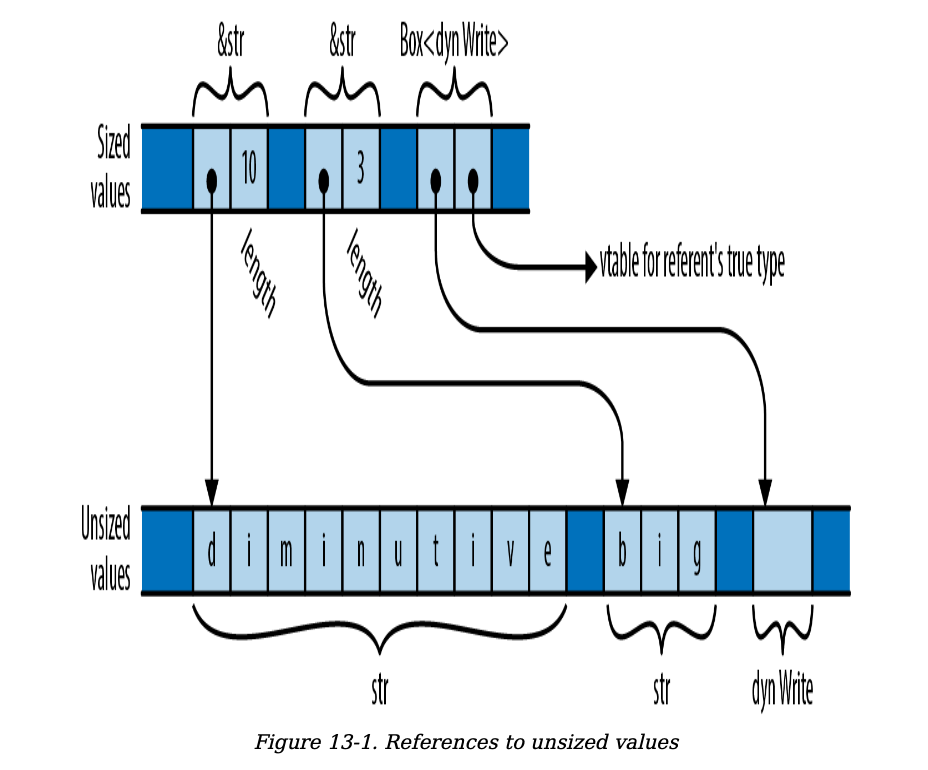

# `Utility Traits`

| Trait                        | Description                                                                                                            |
| ---------------------------- | ---------------------------------------------------------------------------------------------------------------------- |
| **Drop**                     | **Destructors.** Cleanup code that Rust runs automatically whenever a value is dropped.                                |
| **Sized**                    | **Marker trait** for types with a fixed size known at compile time, unlike dynamically sized types.                    |
| **Clone**                    | Types that support cloning values.                                                                                     |
| **Copy**                     | **Marker trait** for types that can be cloned simply by making a byte-for-byte copy of the memory.                     |
| **Deref** and **DerefMut**   | Traits for smart pointer types.                                                                                        |
| **Default**                  | Types that have a sensible “default value.”                                                                            |
| **AsRef** and **AsMut**      | **Conversion traits** for borrowing one type of reference from another.                                                |
| **Borrow** and **BorrowMut** | **Conversion traits**, like `AsRef`/`AsMut`, but additionally guaranteeing consistent hashing, ordering, and equality. |
| **From** and **Into**        | **Conversion traits** for transforming one type of value into another.                                                 |
| **TryFrom** and **TryInto**  | **Conversion traits** for transforming one type of value into another, for transformations that might fail.            |
| **ToOwned**                  | **Conversion trait** for converting a reference to an owned value.                                                     |

## `Drop`

When a value is dropped, if it implements `std::ops::Drop`,
Rust calls its drop method, `before` proceeding to drop whatever
values its fields or elements own, as it normally would.
This implicit invocation of drop is the only way to call that method;
if you try to invoke it `explicitly` yourself, Rust flags that as an `error`.

If a type implements Drop, it cannot implement the Copy
trait. The standard prelude includes a function to drop a value,
drop, but its definition is anything but magical:
```rust fn drop<T>(_x: T) { }```

## Sized

The only use for Sized is as a bound for type variables:
a bound like `T: Sized` requires T to be a type whose size is `known at compile time`.
Traits of this sort are called marker traits, because the Rust language itself uses
them to mark certain types as having characteristics of interest.

However, Rust also has a few `unsized` types whose values
are not all the same size. For example, the string slice type
`str` (note, without an &) is unsized.

Rust can’t store unsized values in variables or pass them as
arguments. You can only deal with them through pointers
like &str or Box<dyn Write>, which themselves are sized.



In fact, it is the implicit default in Rust: if
you write struct S<T> { ... }, Rust understands you to
mean struct S<`T: Sized`> { ... }. If you do not want to
constrain T this way, you must explicitly opt out, writing
struct S<`T: ?Sized`> { ... }.

For example, if you write:

```rust
struct S<T: ?Sized> {
  b: Box<T>
}
```

then Rust will allow you to write `S<str>` and `S<dyn Write>`,
where the box becomes a fat pointer, as well as S<i32> and S<String>,
where the box is an ordinary pointer.

you can use this RcBox with sized types, like `RcBox<String>`;
the result is a `sized` struct type. Or you can use it with
unsized types, like `RcBox<dyn std::fmt::Display>`,
RcBox<dyn Display> is an `unsized` struct type

```rust
struct RcBox<T: ?Sized> {
  ref_count: usize,
  value: T,
}
```

## `Clone`

```rust
trait Clone: Sized {
fn clone(&self) -> Self;
  fn clone_from(&mut self, source: &Self) {
    *self = source.clone()
  }
}
```

In generic code, you should use `clone_from`
whenever possible to take advantage of optimized
implementations when present. eg:

if the string s heap buffer belonging to the original s has
enough capacity to hold t’s contents, no allocation or deallocation is necessary:
you can simply copy t’s text into s’s buffer and adjust the length.

Some types don’t make sense to copy, like
`std::sync::Mutex`; those don’t implement Clone.
Some types like `std::fs::File` can be copied, but the copy
might `fail` if the operating system doesn’t have the
necessary resources; these types don’t implement Clone,
since clone must be infallible. Instead, std::fs::File
provides a `try_clone` method, which returns a
std::io::Result<File>, which can report a failure.

If your Clone implementation simply applies clone to each
field or element of your type and then constructs a new
value from those clones, and the default definition of
clone_from is good enough, then Rust will implement that
for you: simply put `#[derive(Clone)]` above your type
definition.

## Copy

Copy is a `marker trait` with special meaning to
the language. ```rust trait Copy: Clone { }```

This is certainly easy to implement for your own types:
```rust impl Copy for MyType { }```

Rust permits a type to implement Copy only if
a shallow `byte-for-byte copy` is all it needs.

Types that own any other resources, like heap buffers or
operating system handles, cannot implement Copy.
Any type that implements the Drop trait cannot be Copy.

## `Deref and DerefMut`

The traits are defined like this:

```rust
trait Deref {
  type Target: ?Sized;
  fn deref(&self) -> &Self::Target;
}
trait DerefMut: Deref {
  fn deref_mut(&mut self) -> &mut Self::Target;
}
```

For example, suppose you have the following type:

```rust
struct Selector<T> {
  /// Elements available in this `Selector`.
  elements: Vec<T>,
  /// The index of the "current" element in `elements`. A
  `Selector`
  /// behaves like a pointer to the current element.
  current: usize
}
```

To make the Selector behave as the doc comment claims,
you must implement Deref and DerefMut for the type:

```rust
use std::ops::{Deref, DerefMut};
impl<T> Deref for Selector<T> {
  type Target = T;
  fn deref(&self) -> &T {
    &self.elements[self.current]
  }
}
impl<T> DerefMut for Selector<T> {
  fn deref_mut(&mut self) -> &mut T {
    &mut self.elements[self.current]
  }
}
```

Given those implementations, you can use a Selector like this:

```rust
let mut s = Selector { elements: vec!['x', 'y', 'z'], current: 2 };
// Because `Selector` implements `Deref`, we can use the `*`
// operator to  refer to its current element.
assert_eq!(*s, 'z');

// Assert that 'z' is alphabetic, using a method of `char`
// directly on a `Selector`, via deref coercion.
assert!(s.is_alphabetic());

// Change the 'z' to a 'w', by assigning to the `Selector`'s referent.
*s = 'w';
assert_eq!(s.elements, ['x', 'y', 'w']);
```

For example, the following code works fine:

```rust
let s = Selector { elements: vec!["good", "bad", "ugly"],current: 2 };
fn show_it(thing: &str) { println!("{}", thing); }
show_it(&s);
```

In the call show_it(&s), Rust sees an argument of type
`&Selector<&str>` and a parameter of type `&str`, finds the
`Deref<Target=str>` implementation, and rewrites the call
to `show_it(s.deref())`, just as needed.

However, if you change show_it into a `generic` function,
Rust is suddenly no longer cooperative:

```rust
use std::fmt::Display;
fn show_it_generic<T: Display>(thing: T) { println!("{}", thing);}
show_it_generic(&s);

Rust complains:
error: `Selector<&str>` doesn't implement `std::fmt::Display`
|
33 | fn show_it_generic<T: Display>(thing: T) { println!("
{}", thing); }
| ------- required by this bound in
| `show_it_generic`
34 | show_it_generic(&s);
| ^^
| |
| `Selector<&str>` cannot be formatted
with the
`&*s`
|
| default formatter
| help: consider adding dereference here:
`&*s`
|
```

Selector<&str> does not implement Display itself,
but it `dereferences` to &str, which certainly does.
Rust checks whether the bound `T: Display` is satisfied:
since it does not apply deref coercions to satisfy bounds
on `type variables`, this check fails.

To work around this problem, you can spell out the
coercion using the `as` operator: ```show_it_generic(&s as &str);```

Or, as the compiler suggests, you can force the coercion
with `&*`: ```show_it_generic(&*s);```

The Deref and DerefMut traits are `designed` for
implementing `smart pointer types`, like Box, Rc, and Arc,
and types that serve as `owning` versions of `something` you
would also frequently use by reference, the way Vec<T> and
String serve as owning versions of [T] and str.

## `Default`

Some types have a reasonably obvious default value: the
default vector or string is empty, the default number is
zero, the default Option is None, and so on. Types like this
can implement the std::default::Default trait:

```rust
trait Default {
  fn default() -> Self;
}
```

The default method simply returns a fresh value of type
Self. String’s implementation of Default is
straightforward:

```rust
impl Default for String {
  fn default() -> String {
    String::new()
  }
}
```

Another common use of Default is to produce default
values for `structs` that represent a `large` collection of
parameters, most of which you won’t usually need to
change.

The glium draw function expects a `DrawParameters struct` as an argument.
Since DrawParameters implements Default, you can create
one to pass to draw, mentioning only those fields you want
to change:

```rust
let params = glium::DrawParameters {
  line_width: Some(0.02),
  point_size: Some(0.02),
  .. Default::default()
};
target.draw(..., &params).unwrap();
```

If a type T implements Default, then the standard library
implements Default `automatically` for:  

- Rc<T>, Arc<T>, Box<T>
- Cell<T>, RefCell<T>
- Mutex<T>, RwLock<T>
- Cow<T>

The default value for the type Rc<T>,
for example, is an Rc pointing to the default value for type T.

If all the element types of a `tuple` type implement Default,
then the tuple type does too, defaulting to a tuple holding
each element’s default value.

Rust does not `implicitly` implement Default for struct
types, but if all of a struct’s fields implement Default, you
can implement Default for the struct automatically using `#[derive(Default)]`.
