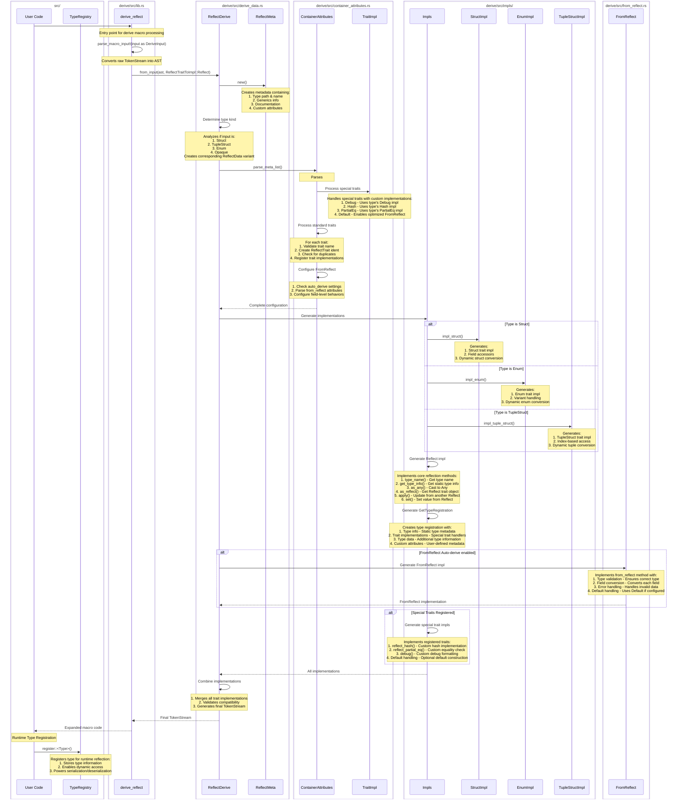

# Obel Reflect

[](https://github.com/obelengine/obel#license)
[](https://crates.io/crates/obel_reflect)
[](https://crates.io/crates/obel_reflect)
[](https://docs.rs/obel_reflect/latest/obel_reflect/)
[](https://discord.gg/obel)

This crate enables you to dynamically interact with Rust types:

- Derive the `Reflect` traits
- Interact with fields using their names (for named structs) or indices (for tuple structs)
- "Patch" your types with new values
- Look up nested fields using "path strings"
- Iterate over struct fields
- Automatically serialize and deserialize via Serde (without explicit serde impls)
- Trait "reflection"

## Features

### Derive the `Reflect` traits

```rust ignore
// this will automatically implement the `Reflect` trait and the `Struct` trait (because the type is a struct)
#[derive(Reflect)]
struct Foo {
    a: u32,
    b: Bar,
    c: Vec<i32>,
    d: Vec<Baz>,
}

// this will automatically implement the `Reflect` trait and the `TupleStruct` trait (because the type is a tuple struct)
#[derive(Reflect)]
struct Bar(String);

#[derive(Reflect)]
struct Baz {
    value: f32,
}

// We will use this value to illustrate `obel_reflect` features
let mut foo = Foo {
    a: 1,
    b: Bar("hello".to_string()),
    c: vec![1, 2],
    d: vec![Baz { value: 3.14 }],
};
```

### Interact with fields using their names

```rust ignore
assert_eq!(*foo.get_field::<u32>("a").unwrap(), 1);

*foo.get_field_mut::<u32>("a").unwrap() = 2;

assert_eq!(foo.a, 2);
```

### "Patch" your types with new values

```rust ignore
let mut dynamic_struct = DynamicStruct::default();
dynamic_struct.insert("a", 42u32);
dynamic_struct.insert("c", vec![3, 4, 5]);

foo.apply(&dynamic_struct);

assert_eq!(foo.a, 42);
assert_eq!(foo.c, vec![3, 4, 5]);
```

### Look up nested fields using "path strings"

```rust ignore
let value = *foo.get_path::<f32>("d[0].value").unwrap();
assert_eq!(value, 3.14);
```

### Iterate over struct fields

```rust ignore
for (i, value: &Reflect) in foo.iter_fields().enumerate() {
    let field_name = foo.name_at(i).unwrap();
    if let Some(value) = value.downcast_ref::<u32>() {
        println!("{} is a u32 with the value: {}", field_name, *value);
    }
}
```

### Automatically serialize and deserialize via Serde (without explicit serde impls)

```rust ignore
let mut registry = TypeRegistry::default();
registry.register::<u32>();
registry.register::<i32>();
registry.register::<f32>();
registry.register::<String>();
registry.register::<Bar>();
registry.register::<Baz>();

let serializer = ReflectSerializer::new(&foo, &registry);
let serialized = ron::ser::to_string_pretty(&serializer, ron::ser::PrettyConfig::default()).unwrap();

let mut deserializer = ron::de::Deserializer::from_str(&serialized).unwrap();
let reflect_deserializer = ReflectDeserializer::new(&registry);
let value = reflect_deserializer.deserialize(&mut deserializer).unwrap();
let dynamic_struct = value.take::<DynamicStruct>().unwrap();

assert!(foo.reflect_partial_eq(&dynamic_struct).unwrap());
```

### Trait "reflection"

Call a trait on a given `&dyn Reflect` reference without knowing the underlying type!

```rust ignore
#[derive(Reflect)]
#[reflect(DoThing)]
struct MyType {
    value: String,
}

impl DoThing for MyType {
    fn do_thing(&self) -> String {
        format!("{} World!", self.value)
    }
}

#[reflect_trait]
pub trait DoThing {
    fn do_thing(&self) -> String;
}

// First, lets box our type as a Box<dyn Reflect>
let reflect_value: Box<dyn Reflect> = Box::new(MyType {
    value: "Hello".to_string(),
});

// This means we no longer have direct access to MyType or its methods. We can only call Reflect methods on reflect_value.
// What if we want to call `do_thing` on our type? We could downcast using reflect_value.downcast_ref::<MyType>(), but what if we
// don't know the type at compile time?

// Normally in rust we would be out of luck at this point. Lets use our new reflection powers to do something cool!
let mut type_registry = TypeRegistry::default();
type_registry.register::<MyType>();

// The #[reflect] attribute we put on our DoThing trait generated a new `ReflectDoThing` struct, which implements TypeData.
// This was added to MyType's TypeRegistration.
let reflect_do_thing = type_registry
    .get_type_data::<ReflectDoThing>(reflect_value.type_id())
    .unwrap();

// We can use this generated type to convert our `&dyn Reflect` reference to a `&dyn DoThing` reference
let my_trait: &dyn DoThing = reflect_do_thing.get(&*reflect_value).unwrap();

// Which means we can now call do_thing(). Magic!
println!("{}", my_trait.do_thing());

// This works because the #[reflect(MyTrait)] we put on MyType informed the Reflect derive to insert a new instance
// of ReflectDoThing into MyType's registration. The instance knows how to cast &dyn Reflect to &dyn DoThing, because it
// knows that &dyn Reflect should first be downcasted to &MyType, which can then be safely casted to &dyn DoThing
```

## Why make this?

The whole point of Rust is static safety! Why build something that makes it easy to throw it all away?

- Some problems are inherently dynamic (scripting, some types of serialization / deserialization)
- Sometimes the dynamic way is easier
- Sometimes the dynamic way puts less burden on your users to derive a bunch of traits (this was a big motivator for the obel project)

## `Sequence Diagram`

The following sequence diagram illustrates how a type with `#[derive(Reflect)]` is processed:


